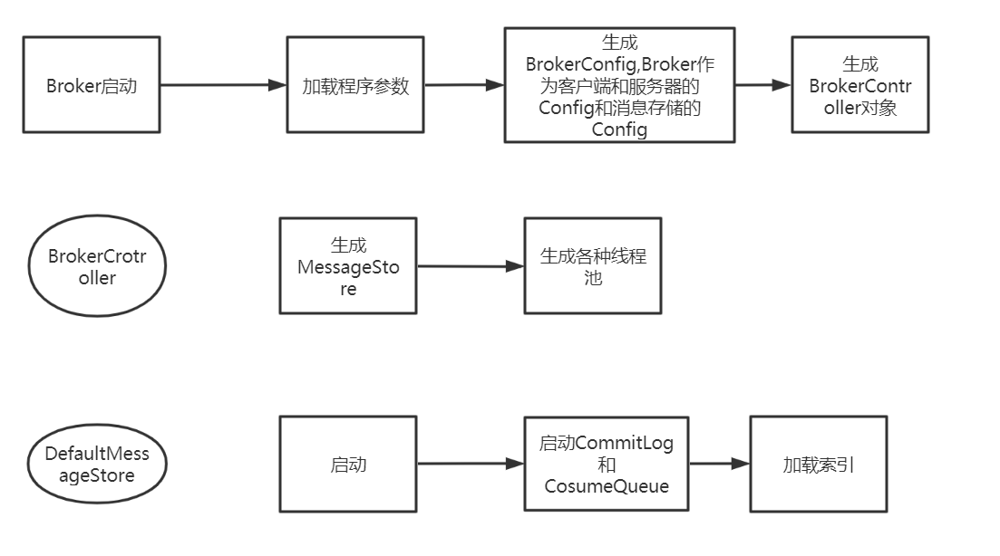

# RocketMQ源码分析之Broker和NameServer启动

Broker入口


**org\apache\rocketmq\broker\BrokerStartup.java**


```
public static void main(String[] args) {
    start(createBrokerController(args));
}
```


```
public static BrokerController createBrokerController(String[] args) {
//..
 
//      创建关于Broker ,Client和NameServer和消息存储之间的配置
        final BrokerConfig brokerConfig = new BrokerConfig();
        final NettyServerConfig nettyServerConfig = new NettyServerConfig();
        final NettyClientConfig nettyClientConfig = new NettyClientConfig();
        final MessageStoreConfig messageStoreConfig = new   MessageStoreConfig();
//...

//      加载Broker.Config文件的相关配置(可以记得在程序参数时输入 -c Broker.Config)
        if (commandLine.hasOption('c')) {
                String file = commandLine.getOptionValue('c');
                if (file != null) {
                    configFile = file;
                    InputStream inputStream=new FileInputStream(file);
                    InputStream in = new BufferedInputStream(inputStream);
                    properties = new Properties();
                    properties.load(in);
                    properties2SystemEnv(properties);
                    MixAll.properties2Object(properties, brokerConfig);
                    MixAll.properties2Object(properties, nettyServerConfig);
                    MixAll.properties2Object(properties, nettyClientConfig);
                    MixAll.properties2Object(properties, messageStoreConfig);

                    BrokerPathConfigHelper.setBrokerConfigPath(file);
                    in.close();
                }
            }
 //         通过四大配置生成BrokerCrotroller并初始化           
            final BrokerController controller = new BrokerController(
                brokerConfig,
                nettyServerConfig,
                nettyClientConfig,
                messageStoreConfig);
            // remember all configs to prevent discard
            controller.getConfiguration().registerConfig(properties);

            boolean initResult = controller.initialize();
}
```


下面咱们进入BrokerController的初始化了解


```
public boolean initialize() throws CloneNotSupportedException {
//      这四个配置Manager都是继承自ConfigManager看一个就能了解大概
        加载文件~/store/config/topics.json
        boolean result = this.topicConfigManager.load();
        // 加载文件~/store/config/consumerOffset.json
        result = result && this.consumerOffsetManager.load();
        // 加载文件~/store/config/subscriptionGroup.json
        result = result && this.subscriptionGroupManager.load();
        // 加载文件~/store/config/consumerFilter.json
        result = result && this.consumerFilterManager.load();

//      这里会加载重要的类DefaultMessageStore,下面会介绍
        if (result) {
            try {
                this.messageStore =
                    new DefaultMessageStore(this.messageStoreConfig, this.brokerStatsManager, this.messageArrivingListener,
                        this.brokerConfig);
                if (messageStoreConfig.isEnableDLegerCommitLog()) {
                    DLedgerRoleChangeHandler roleChangeHandler = new DLedgerRoleChangeHandler(this, (DefaultMessageStore) messageStore);
                    ((DLedgerCommitLog)((DefaultMessageStore) messageStore).getCommitLog()).getdLedgerServer().getdLedgerLeaderElector().addRoleChangeHandler(roleChangeHandler);
                }
                this.brokerStats = new BrokerStats((DefaultMessageStore) this.messageStore);
                //load plugin
                MessageStorePluginContext context = new MessageStorePluginContext(messageStoreConfig, brokerStatsManager, messageArrivingListener, brokerConfig);
                this.messageStore = MessageStoreFactory.build(context, this.messageStore);
                this.messageStore.getDispatcherList().addFirst(new CommitLogDispatcherCalcBitMap(this.brokerConfig, this.consumerFilterManager));
            } catch (IOException e) {
                result = false;
                log.error("Failed to initialize", e);
            }
        }
//      最后加载MessageStore     
        result = result && this.messageStore.load();
        result = result && this.messageStore.load();
    if (result) {
        this.remotingServer = new NettyRemotingServer(this.nettyServerConfig, this.clientHousekeepingService);
        NettyServerConfig fastConfig = (NettyServerConfig) this.nettyServerConfig.clone();
        fastConfig.setListenPort(nettyServerConfig.getListenPort() - 2);
        this.fastRemotingServer = new NettyRemotingServer(fastConfig, this.clientHousekeepingService);
        // 发送消息线程池
        this.sendMessageExecutor = new BrokerFixedThreadPoolExecutor(
            this.brokerConfig.getSendMessageThreadPoolNums(),
            this.brokerConfig.getSendMessageThreadPoolNums(),
            1000 * 60,
            TimeUnit.MILLISECONDS,
            this.sendThreadPoolQueue,
            new ThreadFactoryImpl("SendMessageThread_"));
        // 拉消息线程池
        this.pullMessageExecutor = new BrokerFixedThreadPoolExecutor(
            this.brokerConfig.getPullMessageThreadPoolNums(),
            this.brokerConfig.getPullMessageThreadPoolNums(),
            1000 * 60,
            TimeUnit.MILLISECONDS,
            this.pullThreadPoolQueue,
            new ThreadFactoryImpl("PullMessageThread_"));
        //回复消息线程池    
        this.replyMessageExecutor = new BrokerFixedThreadPoolExecutor(
                this.brokerConfig.getProcessReplyMessageThreadPoolNums(),
                this.brokerConfig.getProcessReplyMessageThreadPoolNums(),
                1000 * 60,
                TimeUnit.MILLISECONDS,
                this.replyThreadPoolQueue,
                new ThreadFactoryImpl("ProcessReplyMessageThread_"));    
        // 查询消息线程池
        this.queryMessageExecutor = new BrokerFixedThreadPoolExecutor(
            this.brokerConfig.getQueryMessageThreadPoolNums(),
            this.brokerConfig.getQueryMessageThreadPoolNums(),
            1000 * 60,
            TimeUnit.MILLISECONDS,
            this.queryThreadPoolQueue,
            new ThreadFactoryImpl("QueryMessageThread_"));
        // 管理broker线程池
        this.adminBrokerExecutor =
            Executors.newFixedThreadPool(this.brokerConfig.getAdminBrokerThreadPoolNums(), new ThreadFactoryImpl(
                "AdminBrokerThread_"));
        this.clientManageExecutor = new ThreadPoolExecutor(
            this.brokerConfig.getClientManageThreadPoolNums(),
            this.brokerConfig.getClientManageThreadPoolNums(),
            1000 * 60,
            TimeUnit.MILLISECONDS,
            this.clientManagerThreadPoolQueue,
            new ThreadFactoryImpl("ClientManageThread_"));
        // 心跳线程池
        this.heartbeatExecutor = new BrokerFixedThreadPoolExecutor(
            this.brokerConfig.getHeartbeatThreadPoolNums(),
            this.brokerConfig.getHeartbeatThreadPoolNums(),
            1000 * 60,
            TimeUnit.MILLISECONDS,
            this.heartbeatThreadPoolQueue,
            new ThreadFactoryImpl("HeartbeatThread_", true));
        // 结束事务线程池
        this.endTransactionExecutor = new BrokerFixedThreadPoolExecutor(
            this.brokerConfig.getEndTransactionThreadPoolNums(),
            this.brokerConfig.getEndTransactionThreadPoolNums(),
            1000 * 60,
            TimeUnit.MILLISECONDS,
            this.endTransactionThreadPoolQueue,
            new ThreadFactoryImpl("EndTransactionThread_"));
        // 消费者管理线程池
        this.consumerManageExecutor =
            Executors.newFixedThreadPool(this.brokerConfig.getConsumerManageThreadPoolNums(), new ThreadFactoryImpl(
                "ConsumerManageThread_"));
        // 注册各种处理器，大概分为消息发送、消息拉取、消息查询、客户端管理、消费者管理、事务结束和默认处理器这些种
        this.registerProcessor();
        final long initialDelay = UtilAll.computNextMorningTimeMillis() - System.currentTimeMillis();
        final long period = 1000 * 60 * 60 * 24;
        this.scheduledExecutorService.scheduleAtFixedRate(new Runnable() {
            @Override
            public void run() {
                try {
                    // 定时打印broker的状态
                    BrokerController.this.getBrokerStats().record();
                } catch (Throwable e) {
                    log.error("schedule record error.", e);
                }
            }
        }, initialDelay, period, TimeUnit.MILLISECONDS);
        this.scheduledExecutorService.scheduleAtFixedRate(new Runnable() {
            @Override
            public void run() {
                try {
                    // 定时持久化消费者偏移量，持久化文件为~/store/config/consumerOffset.json
                    BrokerController.this.consumerOffsetManager.persist();
                } catch (Throwable e) {
                    log.error("schedule persist consumerOffset error.", e);
                }
            }
        }, 1000 * 10, this.brokerConfig.getFlushConsumerOffsetInterval(), TimeUnit.MILLISECONDS);
        this.scheduledExecutorService.scheduleAtFixedRate(new Runnable() {
            @Override
            public void run() {
                try {
                    // 定时持久化消费者过滤器，持久化文件为~/store/config/consumerFilter.json
                    BrokerController.this.consumerFilterManager.persist();
                } catch (Throwable e) {
                    log.error("schedule persist consumer filter error.", e);
                }
            }
        }, 1000 * 10, 1000 * 10, TimeUnit.MILLISECONDS);
        this.scheduledExecutorService.scheduleAtFixedRate(new Runnable() {
            @Override
            public void run() {
                try {
                    // 保护broker，这里的操作主要是在开启disableConsumeIfConsumerReadSlowly配置的情况下，禁用掉消费慢的consumer，从而保护broker
                    BrokerController.this.protectBroker();
                } catch (Throwable e) {
                    log.error("protectBroker error.", e);
                }
            }
        }, 3, 3, TimeUnit.MINUTES);
        this.scheduledExecutorService.scheduleAtFixedRate(new Runnable() {
            @Override
            public void run() {
                try {
                    // 定时打印水位，主要是一些核心队列状态的打印，如当前队列大小，队列头部任务从创建到现在的时间等
                    BrokerController.this.printWaterMark();
                } catch (Throwable e) {
                    log.error("printWaterMark error.", e);
                }
            }
        }, 10, 1, TimeUnit.SECONDS);
        this.scheduledExecutorService.scheduleAtFixedRate(new Runnable() {
            @Override
            public void run() {
                try {
                    // 定时打印已存储在提交日志中但尚未调度到消费队列的字节数
                    log.info("dispatch behind commit log {} bytes", BrokerController.this.getMessageStore().dispatchBehindBytes());
                } catch (Throwable e) {
                    log.error("schedule dispatchBehindBytes error.", e);
                }
            }
        }, 1000 * 10, 1000 * 60, TimeUnit.MILLISECONDS);
        if (this.brokerConfig.getNamesrvAddr() != null) {
            // 指定了namesrvAddr则更新NameServer的地址
            this.brokerOuterAPI.updateNameServerAddressList(this.brokerConfig.getNamesrvAddr());
            log.info("Set user specified name server address: {}", this.brokerConfig.getNamesrvAddr());
        } else if (this.brokerConfig.isFetchNamesrvAddrByAddressServer()) {
            this.scheduledExecutorService.scheduleAtFixedRate(new Runnable() {
                @Override
                public void run() {
                    try {
                        // 如果指定了通过地址服务器获取地址，则定时获取并更新NameServer地址
                        BrokerController.this.brokerOuterAPI.fetchNameServerAddr();
                    } catch (Throwable e) {
                        log.error("ScheduledTask fetchNameServerAddr exception", e);
                    }
                }
            }, 1000 * 10, 1000 * 60 * 2, TimeUnit.MILLISECONDS);
        }
        if (BrokerRole.SLAVE == this.messageStoreConfig.getBrokerRole()) {
            // 如果指定了haMasterAddress，则不需要定期更新haMasterAddress
            if (this.messageStoreConfig.getHaMasterAddress() != null && this.messageStoreConfig.getHaMasterAddress().length() >= 6) {
                this.messageStore.updateHaMasterAddress(this.messageStoreConfig.getHaMasterAddress());
                this.updateMasterHAServerAddrPeriodically = false;
            } else {
                this.updateMasterHAServerAddrPeriodically = true;
            }
            this.scheduledExecutorService.scheduleAtFixedRate(new Runnable() {
                @Override
                public void run() {
                    try {
                        // slave角色的broker定时从master同步方法开始提到的四种文件对应的信息
                        BrokerController.this.slaveSynchronize.syncAll();
                    } catch (Throwable e) {
                        log.error("ScheduledTask syncAll slave exception", e);
                    }
                }
            }, 1000 * 10, 1000 * 60, TimeUnit.MILLISECONDS);
        } else {
            this.scheduledExecutorService.scheduleAtFixedRate(new Runnable() {
                @Override
                public void run() {
                    try {
                        // 定时打印slave落后的字节数（commit log）
                        BrokerController.this.printMasterAndSlaveDiff();
                    } catch (Throwable e) {
                        log.error("schedule printMasterAndSlaveDiff error.", e);
                    }
                }
            }, 1000 * 10, 1000 * 60, TimeUnit.MILLISECONDS);
        }
        if (TlsSystemConfig.tlsMode != TlsMode.DISABLED) {
            // 注册一个监听器以重新加载SslContext
            try {
                fileWatchService = new FileWatchService(
                    new String[] {
                        TlsSystemConfig.tlsServerCertPath,
                        TlsSystemConfig.tlsServerKeyPath,
                        TlsSystemConfig.tlsServerTrustCertPath
                    },
                    new FileWatchService.Listener() {
                        boolean certChanged, keyChanged = false;
                        @Override
                        public void onChanged(String path) {
                            if (path.equals(TlsSystemConfig.tlsServerTrustCertPath)) {
                                log.info("The trust certificate changed, reload the ssl context");
                                reloadServerSslContext();
                            }
                            if (path.equals(TlsSystemConfig.tlsServerCertPath)) {
                                certChanged = true;
                            }
                            if (path.equals(TlsSystemConfig.tlsServerKeyPath)) {
                                keyChanged = true;
                            }
                            if (certChanged && keyChanged) {
                                log.info("The certificate and private key changed, reload the ssl context");
                                certChanged = keyChanged = false;
                                reloadServerSslContext();
                            }
                        }
                        private void reloadServerSslContext() {
                            ((NettyRemotingServer) remotingServer).loadSslContext();
                            ((NettyRemotingServer) fastRemotingServer).loadSslContext();
                        }
                    });
            } catch (Exception e) {
                log.warn("FileWatchService created error, can't load the certificate dynamically");
            }
        }
        // 实例化事务需要的三个变量，transactionalMessageService、transactionalMessageCheckListener、transactionalMessageCheckService
        initialTransaction();
        // 如果启动了ACL权限检查，则实例化AccessValidator并注册RPCHook在请求前使用AccessValidator进行权限校验
        initialAcl();
        // 实例化并注册RPCHook
        initialRpcHooks();
    }
    return result;

}
```


**DefaultMessageStore：**


启动commitLog


```
public boolean load() {
    boolean result = true;
    try {
        // 判断~/store/abort文件是否存在，用于判断进程是否正常退出
        boolean lastExitOK = !this.isTempFileExist();
        log.info("last shutdown {}", lastExitOK ? "normally" : "abnormally");
        if (null != scheduleMessageService) {
            // 加载文件~/store/config/delayOffset.json
            // 将默认的延迟时间“1s 5s 10s 30s 1m 2m 3m 4m 5m 6m 7m 8m 9m 10m 20m 30m 1h 2h”转换为对应的毫秒数
            result = result && this.scheduleMessageService.load();
        }
        // 加载~/store/commitlog目录下的所有文件，并标记每一个文件的写位置、刷新位置和提交位置（也就是commit log文件大小，默认1G）
        result = result && this.commitLog.load();
        // 加载~/store/consumequeue目录下的所有文件
        // 获取文件后构建ConsumeQueue，并设置topic、queueId、ConsumeQueue三者之间的关系
        // 同样标记每一个文件的写位置、刷新位置和提交位置
        result = result && this.loadConsumeQueue();
        if (result) {
            // 加载~/store/checkpoint文件，主要用于确定物理消息、逻辑消息、索引消息三个时间戳
            this.storeCheckpoint =
                new StoreCheckpoint(StorePathConfigHelper.getStoreCheckpoint(this.messageStoreConfig.getStorePathRootDir()));
            // 加载~/store/index目录下的索引文件
            this.indexService.load(lastExitOK);
            /* 恢复动作 */
            this.recover(lastExitOK);
            log.info("load over, and the max phy offset = {}", this.getMaxPhyOffset());
        }
    } catch (Exception e) {
        log.error("load exception", e);
        result = false;
    }
    if (!result) {
        // 如果初始化失败则删除预先分配好的映射文件
        this.allocateMappedFileService.shutdown();
    }
    return result;
}
```


```
private void recover(final boolean lastExitOK) {
    // 恢复消费队列，确定消费队列的最大物理偏移量，对应~/store/consumequeue/目录下面的内容
    long maxPhyOffsetOfConsumeQueue = this.recoverConsumeQueue();
    // 根据上次进程退出的结果判断采取正常/异常commit log恢复，对应~/store/commitlog目录下面的内容
    if (lastExitOK) {
        this.commitLog.recoverNormally(maxPhyOffsetOfConsumeQueue);
    } else {
        this.commitLog.recoverAbnormally(maxPhyOffsetOfConsumeQueue);
    }
    // 恢复topic队列
    this.recoverTopicQueueTable();
}
```


至此 Broker启动完毕,总结一下



#### NameServer启动


入口


```
public static void main(String[] args) {
    main0(args);
}
```


基础代码和Broker大差不差,参数配置然后生成NameServerController


```
public static NamesrvController createNamesrvController(String[] args) throws IOException, JoranException {
    System.setProperty(RemotingCommand.REMOTING_VERSION_KEY, Integer.toString(MQVersion.CURRENT_VERSION));
    //PackageConflictDetect.detectFastjson();

    Options options = ServerUtil.buildCommandlineOptions(new Options());
    commandLine = ServerUtil.parseCmdLine("mqnamesrv", args, buildCommandlineOptions(options), new PosixParser());
    if (null == commandLine) {
        System.exit(-1);
        return null;
    }

    final NamesrvConfig namesrvConfig = new NamesrvConfig();
    final NettyServerConfig nettyServerConfig = new NettyServerConfig();
    nettyServerConfig.setListenPort(9876);
    if (commandLine.hasOption('c')) {
        String file = commandLine.getOptionValue('c');
        if (file != null) {
            InputStream in = new BufferedInputStream(new FileInputStream(file));
            properties = new Properties();
            properties.load(in);
            MixAll.properties2Object(properties, namesrvConfig);
            MixAll.properties2Object(properties, nettyServerConfig);

            namesrvConfig.setConfigStorePath(file);

            System.out.printf("load config properties file OK, %s%n", file);
            in.close();
        }
    }

    if (commandLine.hasOption('p')) {
        InternalLogger console = InternalLoggerFactory.getLogger(LoggerName.NAMESRV_CONSOLE_NAME);
        MixAll.printObjectProperties(console, namesrvConfig);
        MixAll.printObjectProperties(console, nettyServerConfig);
        System.exit(0);
    }

    MixAll.properties2Object(ServerUtil.commandLine2Properties(commandLine), namesrvConfig);

    if (null == namesrvConfig.getRocketmqHome()) {
        System.out.printf("Please set the %s variable in your environment to match the location of the RocketMQ installation%n", MixAll.ROCKETMQ_HOME_ENV);
        System.exit(-2);
    }

    LoggerContext lc = (LoggerContext) LoggerFactory.getILoggerFactory();
    JoranConfigurator configurator = new JoranConfigurator();
    configurator.setContext(lc);
    lc.reset();
    configurator.doConfigure(namesrvConfig.getRocketmqHome() + "/conf/logback_namesrv.xml");

    log = InternalLoggerFactory.getLogger(LoggerName.NAMESRV_LOGGER_NAME);

    MixAll.printObjectProperties(log, namesrvConfig);
    MixAll.printObjectProperties(log, nettyServerConfig);

    final NamesrvController controller = new NamesrvController(namesrvConfig, nettyServerConfig);

    // remember all configs to prevent discard
    controller.getConfiguration().registerConfig(properties);

    return controller;
}
```


Controller启动


```
public static NamesrvController start(final NamesrvController controller) throws Exception {

    if (null == controller) {
        throw new IllegalArgumentException("NamesrvController is null");
    }
    //初始化
    boolean initResult = controller.initialize();
    if (!initResult) {
        controller.shutdown();
        System.exit(-3);
    }

    Runtime.getRuntime().addShutdownHook(new ShutdownHookThread(log, new Callable<Void>() {
        @Override
        public Void call() throws Exception {
            controller.shutdown();
            return null;
        }
    }));

    controller.start();

    return controller;
}
```


具体就不介绍了,比Broker中的东西只少不多,重要的是下面两个类


KVConfigManager用来存放配置信息并关联持久化文件


RouteInfoManager存放Topic路由信息,由Broker主动提供