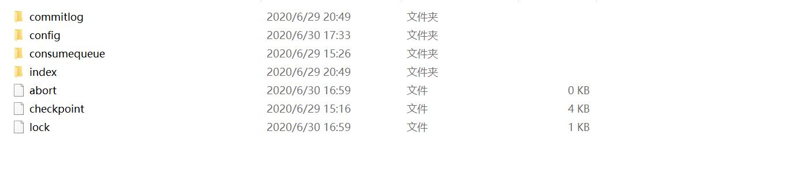
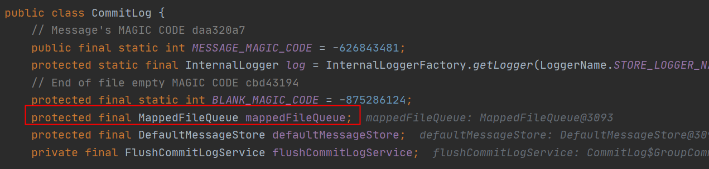
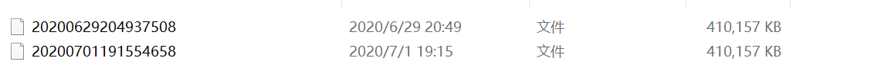
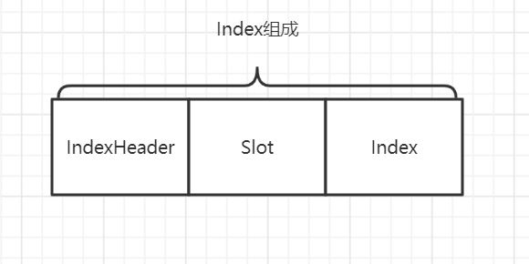
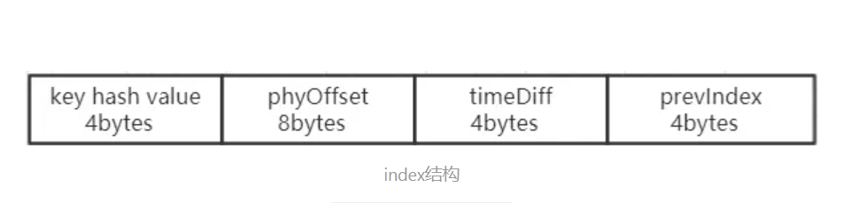

# RocketMQ源码分析之Broker文件结构

RocketMQ的存储与查询是由ConsumeQueue和CommitLog配合完成的，消息存储的物理文件是CommitLog，ConsummeQueue是消息的逻辑队列，逻辑队列里存储了每条消息指向物理存储的地址

,我们可以$HOME/store中找到对应的文件结构

其中Config在Broker启动中已经介绍过,另外三个文件夹都是关于消息存储的

### 1.CommitLog

Broker将传入的所有Message都存储在CommitLog中,每个CommitLog文件大小为1G,文件名(长度20位，左边补0)为该文件中的消息起始偏移量

在代码中CommitLog管理着MappedFileQueue

MappedFileQueue管理着MappedFile,MappedFile就是文件中CommitLog文件夹中的文件

### 2.ConsumeQueue

这里需要了解下RocketMQ的工作流程,Producer生产消息并存放在CommitLog中的某一个MappedFile中,一旦有新的消息出现时就会由ReputMessageService服务找到对应的CommitLogDispatcherBuildConsumeQueue去找到对应Message topic的ConsumeQueue,并将消息偏移信息存储在ConsumeQueue中

可以看到ConsumeQueue也是通过mappedFileQueue来存放对应消息索引的

ConsumeQueue的结构如下,8+4+8存放消息索引

Consumer通过备份监听的Queue的已经消费的位置即对应ConusmeQueue中MappedFile的已经消费的位置与更新后的MappedFile最大位置相比对来判断是否有新的消息需要消费

### 3.Index

Index的作用是为了更快的找到对应的消息在CommitLog中的位置,一般是通过MessageID或者消息的key作为索引的Key

打开索引文件可以发现是以时间戳命名的,后面可以发现这样命名的好处

Index对应的Java中的类是IndexFile,Index由以下三个部分组成

#### IndexHeader结构

对应的IndexHeader如下所示

#### slot结构

Slot是通过索引Key值进行Hash处理,生成的Hash值与SlotNum取模就是对应的Slot的位置,一般是SlotSize*Hash+IndexHeader

Slot中存放的是最后的一个Index索引存放在第几个位置个数为n,然后我们就可以通过n来找到真正的Index索引

#### Index结构

index由下图组成,主要通过对应的时间戳和keyHash值确定唯一,这里也可以看出时间戳的作用,首先可以通过时间戳找到对应的IndexFile文件然后通过Key和时间戳找到对应的CommitLog偏移量

最后可以发现Index通过preIndex进行尾连接,有点像HashMap的感觉