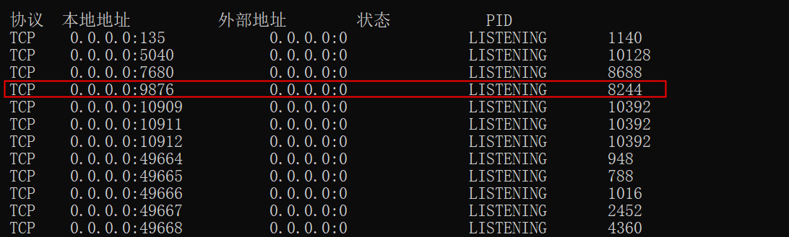
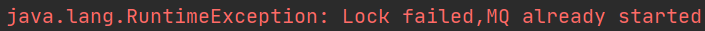
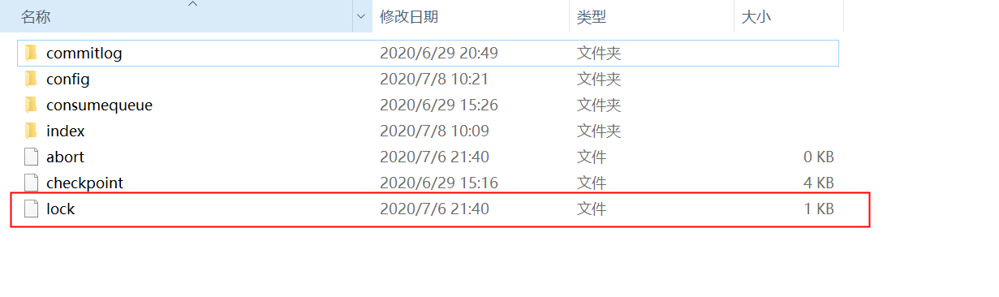
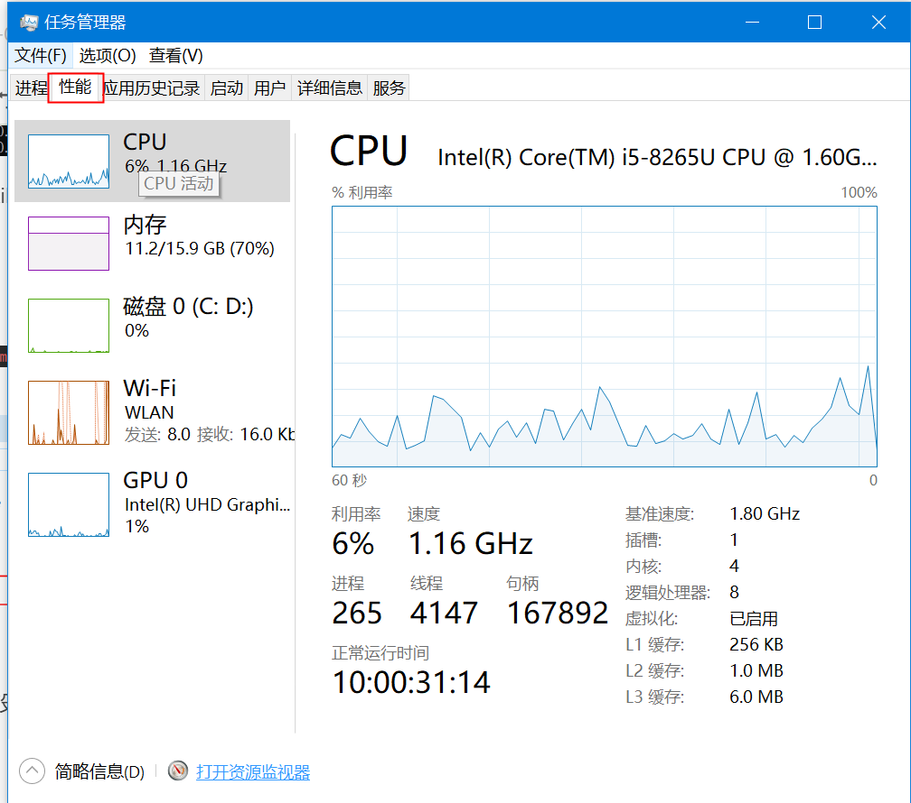
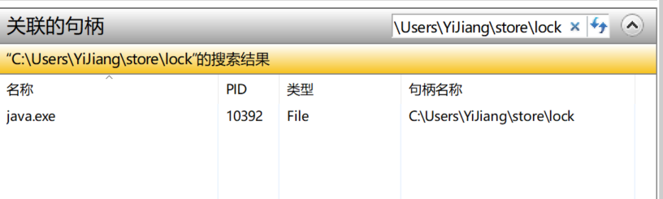

# 意外shutDown导致RocketMQ无法启动的问题

### NameServer

启动会出现 Address already in use:的情况

**解决方法**

先找到哪个进程占用9876端口

**netstat -ano**

****

利用taskkill /f /im 8244 删除即可

### Broker

原因也是程序没关,Lock文件被锁

**解决方法：**

**
**

打开资源管理器,点击性能

打开资源监视器

选择cpu

将被锁文件输入即可找到对应的进程,杀了即可

