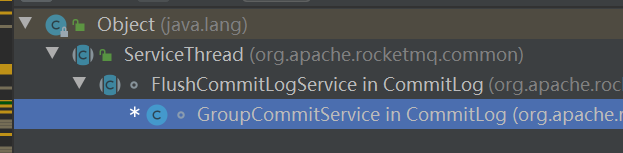
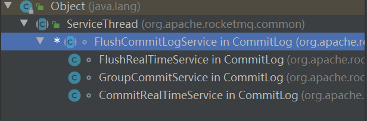
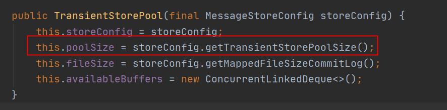
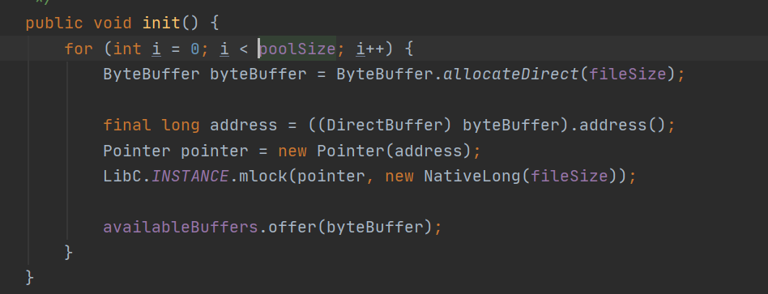
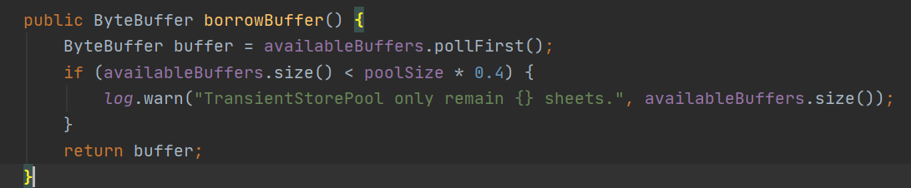
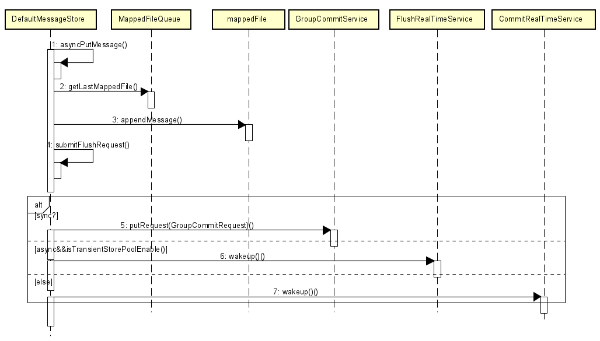

# RocketMQ源码分析之Broker接受消息流程

Producer发送消息以后,Broker会通过Netty接受消息并做处理,这里是通过**SendMessageProcessor**完成对应的任务


**org.apache.rocketmq.broker.processor.SendMessageProcessor#asyncProcessRequest(io.netty.channel.ChannelHandlerContext, org.apache.rocketmq.remoting.protocol.RemotingCommand, org.apache.rocketmq.remoting.netty.RemotingResponseCallback)**


```
public void asyncProcessRequest(ChannelHandlerContext ctx, RemotingCommand request, RemotingResponseCallback responseCallback) throws Exception {
    asyncProcessRequest(ctx, request).thenAcceptAsync(responseCallback::callback, this.brokerController.getSendMessageExecutor());
}
```


根据请求的状态码判断具体方法


```
public CompletableFuture<RemotingCommand> asyncProcessRequest(ChannelHandlerContext ctx,
                                                              RemotingCommand request) throws RemotingCommandException {
    final SendMessageContext mqtraceContext;
    switch (request.getCode()) {
        case RequestCode.CONSUMER_SEND_MSG_BACK:
            return this.asyncConsumerSendMsgBack(ctx, request);
        default:
            SendMessageRequestHeader requestHeader = parseRequestHeader(request);
            if (requestHeader == null) {
                return CompletableFuture.completedFuture(null);
            }
            mqtraceContext = buildMsgContext(ctx, requestHeader);
            this.executeSendMessageHookBefore(ctx, request, mqtraceContext);
            if (requestHeader.isBatch()) {
                return this.asyncSendBatchMessage(ctx, request, mqtraceContext, requestHeader);
            } else {
            //走这里
                return this.asyncSendMessage(ctx, request, mqtraceContext, requestHeader);
            }
    }
}
```


#### 1.核心流程


继续往里走,走到和MessageStore的类的方法是


**org.apache.rocketmq.store.DefaultMessageStore#asyncPutMessage**


```
public CompletableFuture<PutMessageResult> asyncPutMessage(MessageExtBrokerInner msg) {
    //..
    
    //前面一顿检查后,核心方法是写入commitlog
    CompletableFuture<PutMessageResult> putResultFuture = this.commitLog.asyncPutMessage(msg);

   //..

    return putResultFuture;
}
```


**org.apache.rocketmq.store.CommitLog#asyncPutMessage**


```
public CompletableFuture<PutMessageResult> asyncPutMessage(final MessageExtBrokerInner msg) {
   //..

    long elapsedTimeInLock = 0;
    MappedFile unlockMappedFile = null;
    // 获取写入映射文件
    MappedFile mappedFile = this.mappedFileQueue.getLastMappedFile();

    putMessageLock.lock(); //spin or ReentrantLock ,depending on store config
    try {
        long beginLockTimestamp = this.defaultMessageStore.getSystemClock().now();
        this.beginTimeInLock = beginLockTimestamp;

        // Here settings are stored timestamp, in order to ensure an orderly
        // global
        msg.setStoreTimestamp(beginLockTimestamp);

        if (null == mappedFile || mappedFile.isFull()) {
            mappedFile = this.mappedFileQueue.getLastMappedFile(0); // Mark: NewFile may be cause noise
        }
        if (null == mappedFile) {
            log.error("create mapped file1 error, topic: " + msg.getTopic() + " clientAddr: " + msg.getBornHostString());
            beginTimeInLock = 0;
            return CompletableFuture.completedFuture(new PutMessageResult(PutMessageStatus.CREATE_MAPEDFILE_FAILED, null));
        }
        //存储消息
        result = mappedFile.appendMessage(msg, this.appendMessageCallback);
        switch (result.getStatus()) {
            case PUT_OK:
                break;
            case END_OF_FILE:
                unlockMappedFile = mappedFile;
                // Create a new file, re-write the message
                mappedFile = this.mappedFileQueue.getLastMappedFile(0);
                if (null == mappedFile) {
                    // XXX: warn and notify me
                    log.error("create mapped file2 error, topic: " + msg.getTopic() + " clientAddr: " + msg.getBornHostString());
                    beginTimeInLock = 0;
                    return CompletableFuture.completedFuture(new PutMessageResult(PutMessageStatus.CREATE_MAPEDFILE_FAILED, result));
                }
                result = mappedFile.appendMessage(msg, this.appendMessageCallback);
                break;
           //..
        }

        elapsedTimeInLock = this.defaultMessageStore.getSystemClock().now() - beginLockTimestamp;
        beginTimeInLock = 0;
    } finally {
        putMessageLock.unlock();
    }

    if (elapsedTimeInLock > 500) {
        log.warn("[NOTIFYME]putMessage in lock cost time(ms)={}, bodyLength={} AppendMessageResult={}", elapsedTimeInLock, msg.getBody().length, result);
    }

    if (null != unlockMappedFile && this.defaultMessageStore.getMessageStoreConfig().isWarmMapedFileEnable()) {
        this.defaultMessageStore.unlockMappedFile(unlockMappedFile);
    }

    PutMessageResult putMessageResult = new PutMessageResult(PutMessageStatus.PUT_OK, result);
    //..
    
    //刷盘！
    CompletableFuture<PutMessageStatus> flushResultFuture = submitFlushRequest(result, putMessageResult, msg);
   //..
}
```


#### **2.获得MappedFile**


**org.apache.rocketmq.store.MappedFileQueue#getLastMappedFile(long, boolean)**


```
public MappedFile getLastMappedFile(final long startOffset, boolean needCreate) {
    long createOffset = -1;
    MappedFile mappedFileLast = getLastMappedFile();
    // 一个映射文件都不存在
    if (mappedFileLast == null) {
        createOffset = startOffset - (startOffset % this.mappedFileSize);
    }
    // 最后一个文件已满
    if (mappedFileLast != null && mappedFileLast.isFull()) {
        createOffset = mappedFileLast.getFileFromOffset() + this.mappedFileSize;
    }
    // 创建文件
    if (createOffset != -1 && needCreate) {
        String nextFilePath = this.storePath + File.separator + UtilAll.offset2FileName(createOffset);
        String nextNextFilePath = this.storePath + File.separator
            + UtilAll.offset2FileName(createOffset + this.mappedFileSize);
        MappedFile mappedFile = null;

        if (this.allocateMappedFileService != null) {
            mappedFile = this.allocateMappedFileService.putRequestAndReturnMappedFile(nextFilePath,
                nextNextFilePath, this.mappedFileSize);
        } else {
            try {
                mappedFile = new MappedFile(nextFilePath, this.mappedFileSize);
            } catch (IOException e) {
                log.error("create mappedFile exception", e);
            }
        }

        if (mappedFile != null) {
            if (this.mappedFiles.isEmpty()) {
                mappedFile.setFirstCreateInQueue(true);
            }
            this.mappedFiles.add(mappedFile);
        }

        return mappedFile;
    }

    return mappedFileLast;
}
```


#### **3.添加信息**


**org.apache.rocketmq.store.MappedFile#appendMessagesInner**


```
public AppendMessageResult appendMessagesInner(final MessageExt messageExt, final AppendMessageCallback cb) {
    assert messageExt != null;
    assert cb != null;
    
    int currentPos = this.wrotePosition.get();
    
    if (currentPos < this.fileSize) {
    默认使用mappedByteBuffer
        ByteBuffer byteBuffer = writeBuffer != null ? writeBuffer.slice() : this.mappedByteBuffer.slice();
        byteBuffer.position(currentPos);
        AppendMessageResult result;
        if (messageExt instanceof MessageExtBrokerInner) {
            result = cb.doAppend(this.getFileFromOffset(), byteBuffer, this.fileSize - currentPos, (MessageExtBrokerInner) messageExt);
        } else if (messageExt instanceof MessageExtBatch) {
            //这里会写入ByteBuffer
            result = cb.doAppend(this.getFileFromOffset(), byteBuffer, this.fileSize - currentPos, (MessageExtBatch) messageExt);
        } else {
            return new AppendMessageResult(AppendMessageStatus.UNKNOWN_ERROR);
        }
        this.wrotePosition.addAndGet(result.getWroteBytes());
        this.storeTimestamp = result.getStoreTimestamp();
        return result;
    }
    log.error("MappedFile.appendMessage return null, wrotePosition: {} fileSize: {}", currentPos, this.fileSize);
    return new AppendMessageResult(AppendMessageStatus.UNKNOWN_ERROR);
}
```


#### 4.核心添加信息入口


```
public AppendMessageResult doAppend(final long fileFromOffset, final ByteBuffer byteBuffer, final int maxBlank,
            final MessageExtBrokerInner msgInner) {
            
           
            // Record ConsumeQueue information
            keyBuilder.setLength(0);
            keyBuilder.append(msgInner.getTopic());
            keyBuilder.append('-');
            keyBuilder.append(msgInner.getQueueId());
            String key = keyBuilder.toString();
            Long queueOffset = CommitLog.this.topicQueueTable.get(key);
            if (null == queueOffset) {
                queueOffset = 0L;
                CommitLog.this.topicQueueTable.put(key, queueOffset);
            }
            // Transaction messages that require special handling
            final int tranType = MessageSysFlag.getTransactionValue(msgInner.getSysFlag());
            switch (tranType) {
                // Prepared and Rollback message is not consumed, will not enter the
                // consumer queuec
                case MessageSysFlag.TRANSACTION_PREPARED_TYPE:
                case MessageSysFlag.TRANSACTION_ROLLBACK_TYPE:
                    queueOffset = 0L;
                    break;
                case MessageSysFlag.TRANSACTION_NOT_TYPE:
                case MessageSysFlag.TRANSACTION_COMMIT_TYPE:
                default:
                    break;
            }

            /**
             * Serialize message
             */
            final byte[] propertiesData =
                msgInner.getPropertiesString() == null ? null : msgInner.getPropertiesString().getBytes(MessageDecoder.CHARSET_UTF8);

            final int propertiesLength = propertiesData == null ? 0 : propertiesData.length;

            if (propertiesLength > Short.MAX_VALUE) {
                log.warn("putMessage message properties length too long. length={}", propertiesData.length);
                return new AppendMessageResult(AppendMessageStatus.PROPERTIES_SIZE_EXCEEDED);
            }
            //计算消息体长度
            final byte[] topicData = msgInner.getTopic().getBytes(MessageDecoder.CHARSET_UTF8);
            final int topicLength = topicData.length;

            final int bodyLength = msgInner.getBody() == null ? 0 : msgInner.getBody().length;

            final int msgLen = calMsgLength(msgInner.getSysFlag(), bodyLength, topicLength, propertiesLength);

            // Exceeds the maximum message
            if (msgLen > this.maxMessageSize) {
                CommitLog.log.warn("message size exceeded, msg total size: " + msgLen + ", msg body size: " + bodyLength
                    + ", maxMessageSize: " + this.maxMessageSize);
                return new AppendMessageResult(AppendMessageStatus.MESSAGE_SIZE_EXCEEDED);
            }

            // 是否有size放信息
            if ((msgLen + END_FILE_MIN_BLANK_LENGTH) > maxBlank) {
                this.resetByteBuffer(this.msgStoreItemMemory, maxBlank);
                // 1 TOTALSIZE
                this.msgStoreItemMemory.putInt(maxBlank);
                // 2 MAGICCODE
                this.msgStoreItemMemory.putInt(CommitLog.BLANK_MAGIC_CODE);
                // 3 The remaining space may be any value
                // Here the length of the specially set maxBlank
                final long beginTimeMills = CommitLog.this.defaultMessageStore.now();
                byteBuffer.put(this.msgStoreItemMemory.array(), 0, maxBlank);
                return new AppendMessageResult(AppendMessageStatus.END_OF_FILE, wroteOffset, maxBlank, msgId, msgInner.getStoreTimestamp(),
                    queueOffset, CommitLog.this.defaultMessageStore.now() - beginTimeMills);
            }

           //消息封装到msgStoreIteMemory
           
            //核心内容,把数据放入ByteBuffer中
            byteBuffer.put(this.msgStoreItemMemory.array(), 0, msgLen);

            //..
            
            
        }
```


#### **5.刷盘**


刷盘分为同步刷盘和异步刷盘,下面会有介绍


```
public CompletableFuture<PutMessageStatus> submitFlushRequest(AppendMessageResult result, PutMessageResult putMessageResult,
                                                              MessageExt messageExt) {
    // 同步刷盘
    if (FlushDiskType.SYNC_FLUSH == this.defaultMessageStore.getMessageStoreConfig().getFlushDiskType()) {
        final GroupCommitService service = (GroupCommitService) this.flushCommitLogService;
        if (messageExt.isWaitStoreMsgOK()) {
            GroupCommitRequest request = new GroupCommitRequest(result.getWroteOffset() + result.getWroteBytes(),
                    this.defaultMessageStore.getMessageStoreConfig().getSyncFlushTimeout());
            service.putRequest(request);
            return request.future();
        } else {
            service.wakeup();
            return CompletableFuture.completedFuture(PutMessageStatus.PUT_OK);
        }
    }
    // 异步刷盘
    else {
        if (!this.defaultMessageStore.getMessageStoreConfig().isTransientStorePoolEnable()) {
            flushCommitLogService.wakeup();
        } else  {
            commitLogService.wakeup();
        }
        return CompletableFuture.completedFuture(PutMessageStatus.PUT_OK);
    }
}
```


我们先进入同步刷盘,这里的ServiceThread实际上继承自Thread,那这里可以发现GroupCommitService其实是一个线程,在输入任务GroupCommitRequest后会运行方法





**org.apache.rocketmq.store.CommitLog.GroupCommitService#doCommit**


```
private void doCommit() {
    synchronized (this.requestsRead) {
        if (!this.requestsRead.isEmpty()) {
            for (GroupCommitRequest req : this.requestsRead) {
                // There may be a message in the next file, so a maximum of
                // two times the flush
                boolean flushOK = false;
                for (int i = 0; i < 2 && !flushOK; i++) {
                    flushOK = CommitLog.this.mappedFileQueue.getFlushedWhere() >= req.getNextOffset();
                    //核心代码就这一句
                    if (!flushOK) {
                        CommitLog.this.mappedFileQueue.flush(0);
                    }
                }

                req.wakeupCustomer(flushOK ? PutMessageStatus.PUT_OK : PutMessageStatus.FLUSH_DISK_TIMEOUT);
            }

            long storeTimestamp = CommitLog.this.mappedFileQueue.getStoreTimestamp();
            if (storeTimestamp > 0) {
                CommitLog.this.defaultMessageStore.getStoreCheckpoint().setPhysicMsgTimestamp(storeTimestamp);
            }

            this.requestsRead.clear();
        } else {
            // Because of individual messages is set to not sync flush, it
            // will come to this process
            CommitLog.this.mappedFileQueue.flush(0);
        }
    }
}
```


继续点进入可以看到MappedFile如何刷盘,这里可以发现就是调动了force方法,这里是强制刷盘,意义在于将PageCache中的数据刷到磁盘中


**org.apache.rocketmq.store.MappedFile#flush**


```
public int flush(final int flushLeastPages) {
    if (this.isAbleToFlush(flushLeastPages)) {
        if (this.hold()) {
            int value = getReadPosition();

            try {
              //利用WriteBuffer异步刷盘
                if (writeBuffer != null || this.fileChannel.position() != 0) {
                    this.fileChannel.force(false);
              //利用mappedByteBuffer同步或异步刷盘      
                } else {
                    this.mappedByteBuffer.force();
                }
            } catch (Throwable e) {
                log.error("Error occurred when force data to disk.", e);
            }

            this.flushedPosition.set(value);
            this.release();
        } else {
            log.warn("in flush, hold failed, flush offset = " + this.flushedPosition.get());
            this.flushedPosition.set(getReadPosition());
        }
    }
    return this.getFlushedPosition();
}
```


这里总结下刷盘,刷盘分为同步刷盘和异步刷盘两种,可以通过Broker.Conf进行配置,在程序中都是通过FlushCommitLogService的子类来完成刷盘工作





**GroupCommitService**：MmapByteBuffer同步刷盘


**FlushRealTimeService**：MmapByteBuffer异步刷盘


**CommitRealTimeService**：临时的ByteBuffer异步刷盘


​	一般来说同步刷盘比异步刷盘性能差一些,但是由于会在flush成功后再返回所以不会丢失数据,而采用临时的ByteBuffer由于会堆积部分message以后再进行刷盘,所以性能更好,但是出现问题丢失数据更多


​	对于临时的ByteBuffer是通过文件的形式配置来构建,可以从下文看出writeBuffer来自storeConfig也就是Broker的配置





#### 6.总结


