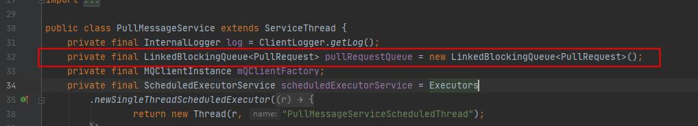
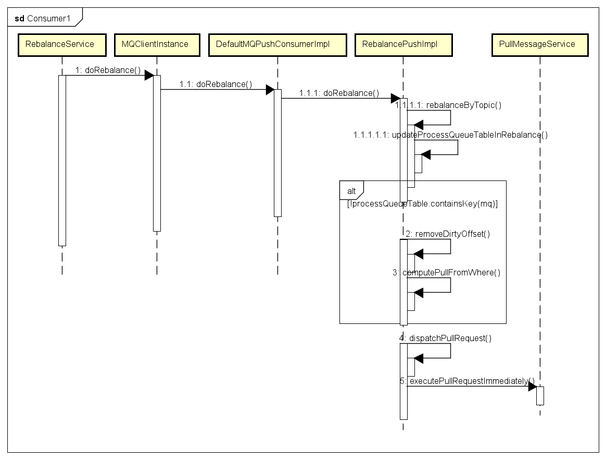

# RocketMQ源码分析之Consumer端(上）

启动Consumer代码


```
public static void main(String[] args) throws InterruptedException, MQClientException {

        /*
         * Instantiate with specified consumer group name.
         */
        DefaultMQPushConsumer consumer = new DefaultMQPushConsumer("please_rename_unique_group_name_4");

        consumer.setNamesrvAddr("127.0.0.1:9876");
        /*
         * Specify where to start in case the specified consumer group is a brand new one.
         */
        consumer.setConsumeFromWhere(ConsumeFromWhere.CONSUME_FROM_FIRST_OFFSET);
        /*
         * Subscribe one more more topics to consume.
         */
        consumer.subscribe("TopicTest", "*");

        /*
         *  Register callback to execute on arrival of messages fetched from brokers.
         */
        consumer.registerMessageListener(new MessageListenerConcurrently() {

            @Override
            public ConsumeConcurrentlyStatus consumeMessage(List<MessageExt> msgs,
                ConsumeConcurrentlyContext context) {
                System.out.printf("%s Receive New Messages: %s %n", Thread.currentThread().getName(), msgs);
                return ConsumeConcurrentlyStatus.CONSUME_SUCCESS;
            }
        });

        /*
         *  Launch the consumer instance.
         */
        consumer.start();

        System.out.printf("Consumer Started.%n");
    }
```


**org.apache.rocketmq.client.impl.consumer.DefaultMQPushConsumerImpl#subscribe(java.lang.String, java.lang.String)**

开始注册监听的topic

```
public void subscribe(String topic, String subExpression) throws MQClientException {
        try {
            // 创建订阅数据
            SubscriptionData subscriptionData = FilterAPI.buildSubscriptionData(this.defaultMQPushConsumer.getConsumerGroup(),
                topic, subExpression);
            this.rebalanceImpl.getSubscriptionInner().put(topic, subscriptionData);
            // 通过心跳同步Consumer信息到Broker
            if (this.mQClientFactory != null) {
                this.mQClientFactory.sendHeartbeatToAllBrokerWithLock();
            }
        } catch (Exception e) {
            throw new MQClientException("subscription exception", e);
        }
    }
```


对注册的信息进行处理,比如topic表达式

**org.apache.rocketmq.common.filter.FilterAPI#buildSubscriptionData**

```
 public static SubscriptionData buildSubscriptionData(final String consumerGroup, String topic,
        String subString) throws Exception {
        SubscriptionData subscriptionData = new SubscriptionData();
        subscriptionData.setTopic(topic);
        subscriptionData.setSubString(subString);
        // 处理订阅表达式
        if (null == subString || subString.equals(SubscriptionData.SUB_ALL) || subString.length() == 0) {
            subscriptionData.setSubString(SubscriptionData.SUB_ALL);
        } else {
            String[] tags = subString.split("\\|\\|");
            if (tags.length > 0) {
                for (String tag : tags) {
                    if (tag.length() > 0) {
                        String trimString = tag.trim();
                        if (trimString.length() > 0) {
                            subscriptionData.getTagsSet().add(trimString);
                            subscriptionData.getCodeSet().add(trimString.hashCode());
                        }
                    }
                }
            } else {
                throw new Exception("subString split error");
            }
        }

        return subscriptionData;
    }
```


## RebalanceService

```
public class RebalanceService extends ServiceThread {
    private static long waitInterval =
        Long.parseLong(System.getProperty(
            "rocketmq.client.rebalance.waitInterval", "20000"));
    private final InternalLogger log = ClientLogger.getLog();
    private final MQClientInstance mqClientFactory;

    public RebalanceService(MQClientInstance mqClientFactory) {
        this.mqClientFactory = mqClientFactory;
    }

    @Override
    public void run() {
        log.info(this.getServiceName() + " service started");

        while (!this.isStopped()) {
            this.waitForRunning(waitInterval);
            this.mqClientFactory.doRebalance();
        }

        log.info(this.getServiceName() + " service end");
    }

    @Override
    public String getServiceName() {
        return RebalanceService.class.getSimpleName();
    }
}
```

可以看到RebalanceService也是一个线程,每过一个时间间隔DoRebalance一下


org.apache.rocketmq.client.impl.factory.MQClientInstance#doRebalance

```
public void doRebalance() {
        for (Map.Entry<String, MQConsumerInner> entry : this.consumerTable.entrySet()) {
            MQConsumerInner impl = entry.getValue();
            if (impl != null) {
                try {
                    impl.doRebalance();
                } catch (Throwable e) {
                    log.error("doRebalance exception", e);
                }
            }
        }
    }
```

遍历每一个组MQConsumerInner进行deRebalance,MQConsumerInner代表一个group


继续进去


```
public void doRebalance(final boolean isOrder) {
        Map<String, SubscriptionData> subTable = this.getSubscriptionInner();
     // 分配每个 topic 的消息队列
        if (subTable != null) {
            for (final Map.Entry<String, SubscriptionData> entry : subTable.entrySet()) {
                final String topic = entry.getKey();
                try {
                    this.rebalanceByTopic(topic, isOrder);
                } catch (Throwable e) {
                    if (!topic.startsWith(MixAll.RETRY_GROUP_TOPIC_PREFIX)) {
                        log.warn("rebalanceByTopic Exception", e);
                    }
                }
            }
        }

        this.truncateMessageQueueNotMyTopic();
    }
```

继续进入rebalanceByTopic方法


org.apache.rocketmq.client.impl.consumer.RebalanceImpl#rebalanceByTopic

```
private void rebalanceByTopic(final String topic, final boolean isOrder) {
        switch (messageModel) {
          //...
                
            case CLUSTERING: {
                // 获取 topic 对应的 队列 和 consumer信息
                Set<MessageQueue> mqSet = this.topicSubscribeInfoTable.get(topic);
                List<String> cidAll = this.mQClientFactory.findConsumerIdList(topic, consumerGroup);
                if (null == mqSet) {
                    if (!topic.startsWith(MixAll.RETRY_GROUP_TOPIC_PREFIX)) {
                        log.warn("doRebalance, {}, but the topic[{}] not exist.", consumerGroup, topic);
                    }
                }

                if (null == cidAll) {
                    log.warn("doRebalance, {} {}, get consumer id list failed", consumerGroup, topic);
                }

                if (mqSet != null && cidAll != null) {
                    List<MessageQueue> mqAll = new ArrayList<MessageQueue>();
                    mqAll.addAll(mqSet);

                    Collections.sort(mqAll);
                    Collections.sort(cidAll);
                    AllocateMessageQueueStrategy strategy = this.allocateMessageQueueStrategy;
                    
                    List<MessageQueue> allocateResult = null;
                    try {//开始为每个Consumer分配对应监听的Queue
                        allocateResult = strategy.allocate(
                            this.consumerGroup,
                            this.mQClientFactory.getClientId(),
                            mqAll,
                            cidAll);
                    } catch (Throwable e) {
                        log.error("AllocateMessageQueueStrategy.allocate Exception. allocateMessageQueueStrategyName={}", strategy.getName(),
                            e);
                        return;
                    }

                    Set<MessageQueue> allocateResultSet = new HashSet<MessageQueue>();
                    if (allocateResult != null) {
                        allocateResultSet.addAll(allocateResult);
                    }

                    boolean changed = this.updateProcessQueueTableInRebalance(topic, allocateResultSet, isOrder);
                    if (changed) {
                        log.info(
                            "rebalanced result changed. allocateMessageQueueStrategyName={}, group={}, topic={}, clientId={}, mqAllSize={}, cidAllSize={}, rebalanceResultSize={}, rebalanceResultSet={}",
                            strategy.getName(), consumerGroup, topic, this.mQClientFactory.getClientId(), mqSet.size(), cidAll.size(),
                            allocateResultSet.size(), allocateResultSet);
                        this.messageQueueChanged(topic, mqSet, allocateResultSet);
                    }
                }
                break;
            }
            default:
                break;
        }
    }
```


org.apache.rocketmq.client.consumer.rebalance.AllocateMessageQueueAveragely#allocate

```
public List<MessageQueue> allocate(String consumerGroup, String currentCID, List<MessageQueue> mqAll,
        List<String> cidAll) {
        if (currentCID == null || currentCID.length() < 1) {
            throw new IllegalArgumentException("currentCID is empty");
        }
        if (mqAll == null || mqAll.isEmpty()) {
            throw new IllegalArgumentException("mqAll is null or mqAll empty");
        }
        if (cidAll == null || cidAll.isEmpty()) {
            throw new IllegalArgumentException("cidAll is null or cidAll empty");
        }

        List<MessageQueue> result = new ArrayList<MessageQueue>();
        if (!cidAll.contains(currentCID)) {
            log.info("[BUG] ConsumerGroup: {} The consumerId: {} not in cidAll: {}",
                consumerGroup,
                currentCID,
                cidAll);
            return result;
        }
        //获得当前consumer对应的索引
        int index = cidAll.indexOf(currentCID);
        //获得均分后是否有多余未分配
        int mod = mqAll.size() % cidAll.size();
        //获得consumer对应的queue size(如果当前的index小于mod则会多分配一个queue
        int averageSize =
            mqAll.size() <= cidAll.size() ? 1 : (mod > 0 && index < mod ? mqAll.size() / cidAll.size()
                + 1 : mqAll.size() / cidAll.size());
        //获得Queue的起始地址
        int startIndex = (mod > 0 && index < mod) ? index * averageSize : index * averageSize + mod;
        int range = Math.min(averageSize, mqAll.size() - startIndex);
        拿到对应的Queue
        for (int i = 0; i < range; i++) {
            result.add(mqAll.get((startIndex + i) % mqAll.size()));
        }
        return result;
    }
```


代码冗余测试

```
 public static void main(String[] args) {
        for (int i = 0; i < 10000; i++) {
            int n=100;
            Random random=new Random();
            int mqSize=random.nextInt(n)+1;
            int cSize=random.nextInt(n)+1;
            //获得当前consumer对应的索引
            int index =random.nextInt(cSize);
            //获得均分后是否有多余未分配
            int mod = mqSize % cSize;
            //获得consumer对应的queue size(如果当前的index小于mod则会多分配一个queue
            int averageSize =
                    mqSize<= cSize ? 1 : (mod > 0 && index < mod ? mqSize / cSize
                            + 1 : mqSize / cSize);
            //获得Queue的起始地址
            int startIndex = (mod > 0 && index < mod) ? index * averageSize : index * averageSize + mod;
            int range = Math.min(averageSize, mqSize - startIndex);
            for (int j = 0; j < range; j++) {
                if(((startIndex + j) % mqSize)==(startIndex + j))
                {
                    continue;
                }
                System.out.println("range:"+range+"index:"+index+"mod:"+mod+"averageSize:"+averageSize+"startIndex:"+startIndex+"mqSize："+mqSize+"cSize:"+cSize);
                break;
            }
            
        }
```

可以发现最后的对mqSize取余是不需要的


org.apache.rocketmq.client.impl.consumer.RebalanceImpl#updateProcessQueueTableInRebalance

```
private boolean updateProcessQueueTableInRebalance(final String topic, final Set<MessageQueue> mqSet,
        final boolean isOrder) {
        boolean changed = false;

        Iterator<Entry<MessageQueue, ProcessQueue>> it = this.processQueueTable.entrySet().iterator();
        while (it.hasNext()) {
            Entry<MessageQueue, ProcessQueue> next = it.next();
            MessageQueue mq = next.getKey();
            ProcessQueue pq = next.getValue();

            if (mq.getTopic().equals(topic)) {
                if (!mqSet.contains(mq)) {
                    pq.setDropped(true);
                    if (this.removeUnnecessaryMessageQueue(mq, pq)) {
                        it.remove();
                        changed = true;
                        log.info("doRebalance, {}, remove unnecessary mq, {}", consumerGroup, mq);
                    }
                } else if (pq.isPullExpired()) {
                    switch (this.consumeType()) {
                        case CONSUME_ACTIVELY:
                            break;
                        case CONSUME_PASSIVELY:
                            pq.setDropped(true);
                            if (this.removeUnnecessaryMessageQueue(mq, pq)) {
                                it.remove();
                                changed = true;
                                log.error("[BUG]doRebalance, {}, remove unnecessary mq, {}, because pull is pause, so try to fixed it",
                                    consumerGroup, mq);
                            }
                            break;
                        default:
                            break;
                    }
                }
            }
        }

        List<PullRequest> pullRequestList = new ArrayList<PullRequest>();
        for (MessageQueue mq : mqSet) {
            if (!this.processQueueTable.containsKey(mq)) {
                if (isOrder && !this.lock(mq)) {
                    log.warn("doRebalance, {}, add a new mq failed, {}, because lock failed", consumerGroup, mq);
                    continue;
                }
                //移除脏数据
                this.removeDirtyOffset(mq);
                ProcessQueue pq = new ProcessQueue();
                //查询消费进度
                long nextOffset = this.computePullFromWhere(mq);
                if (nextOffset >= 0) {
                    ProcessQueue pre = this.processQueueTable.putIfAbsent(mq, pq);
                    if (pre != null) {
                        log.info("doRebalance, {}, mq already exists, {}", consumerGroup, mq);
                    } else {
                        log.info("doRebalance, {}, add a new mq, {}", consumerGroup, mq);
                        PullRequest pullRequest = new PullRequest();
                        pullRequest.setConsumerGroup(consumerGroup);
                        pullRequest.setNextOffset(nextOffset);
                        pullRequest.setMessageQueue(mq);
                        pullRequest.setProcessQueue(pq);
                        pullRequestList.add(pullRequest);
                        changed = true;
                    }
                } else {
                    log.warn("doRebalance, {}, add new mq failed, {}", consumerGroup, mq);
                }
            }
        }
        //拉取消息
        this.dispatchPullRequest(pullRequestList);

        return changed;
    }
```


移除掉不需要的ProcessQueue并且对新监听的ConsumeQueue查找消费进度


org.apache.rocketmq.client.impl.consumer.RebalancePushImpl#computePullFromWhere

```
 @Override
    public long computePullFromWhere(MessageQueue mq) {
        long result = -1;
        final ConsumeFromWhere consumeFromWhere = this.defaultMQPushConsumerImpl.getDefaultMQPushConsumer().getConsumeFromWhere();
        final OffsetStore offsetStore = this.defaultMQPushConsumerImpl.getOffsetStore();
        switch (consumeFromWhere) {
            ///..
                根据消费形式选择不同的消费方法
            case CONSUME_FROM_LAST_OFFSET: {
            //读取消费进度
                long lastOffset = offsetStore.readOffset(mq, ReadOffsetType.READ_FROM_STORE);
                if (lastOffset >= 0) {
                    result = lastOffset;
                }
                // First start,no offset
                else if (-1 == lastOffset) {
                    if (mq.getTopic().startsWith(MixAll.RETRY_GROUP_TOPIC_PREFIX)) {
                        result = 0L;
                    } else {
                        try {
                            result = this.mQClientFactory.getMQAdminImpl().maxOffset(mq);
                        } catch (MQClientException e) {
                            result = -1;
                        }
                    }
                } else {
                    result = -1;
                }
                break;
            }
            case CONSUME_FROM_FIRST_OFFSET: {
                long lastOffset = offsetStore.readOffset(mq, ReadOffsetType.READ_FROM_STORE);
                if (lastOffset >= 0) {
                    result = lastOffset;
                } else if (-1 == lastOffset) {
                    result = 0L;
                } else {
                    result = -1;
                }
                break;
            }
            case CONSUME_FROM_TIMESTAMP: {
                long lastOffset = offsetStore.readOffset(mq, ReadOffsetType.READ_FROM_STORE);
                if (lastOffset >= 0) {
                    result = lastOffset;
                } else if (-1 == lastOffset) {
                    if (mq.getTopic().startsWith(MixAll.RETRY_GROUP_TOPIC_PREFIX)) {
                        try {
                            result = this.mQClientFactory.getMQAdminImpl().maxOffset(mq);
                        } catch (MQClientException e) {
                            result = -1;
                        }
                    } else {
                        try {
                            long timestamp = UtilAll.parseDate(this.defaultMQPushConsumerImpl.getDefaultMQPushConsumer().getConsumeTimestamp(),
                                UtilAll.YYYYMMDDHHMMSS).getTime();
                            result = this.mQClientFactory.getMQAdminImpl().searchOffset(mq, timestamp);
                        } catch (MQClientException e) {
                            result = -1;
                        }
                    }
                } else {
                    result = -1;
                }
                break;
            }

            default:
                break;
        }

        return result;
    }
```


org.apache.rocketmq.client.consumer.store.RemoteBrokerOffsetStore#readOffset

```
public long readOffset(final MessageQueue mq, final ReadOffsetType type) {
        if (mq != null) {
            switch (type) {
                case MEMORY_FIRST_THEN_STORE:
                //从本地缓存读取
                case READ_FROM_MEMORY: {
                    AtomicLong offset = this.offsetTable.get(mq);
                    if (offset != null) {
                        return offset.get();
                    } else if (ReadOffsetType.READ_FROM_MEMORY == type) {
                        return -1;
                    }
                }
                //从远程Broker拉取
                case READ_FROM_STORE: {
                    try {
                        long brokerOffset = this.fetchConsumeOffsetFromBroker(mq);
                        AtomicLong offset = new AtomicLong(brokerOffset);
                        this.updateOffset(mq, offset.get(), false);
                        return brokerOffset;
                    }
                    // No offset in broker
                    catch (MQBrokerException e) {
                        return -1;
                    }
                    //Other exceptions
                    catch (Exception e) {
                        log.warn("fetchConsumeOffsetFromBroker exception, " + mq, e);
                        return -2;
                    }
                }
                default:
                    break;
            }
        }

        return -1;
    }
```


org.apache.rocketmq.client.consumer.store.RemoteBrokerOffsetStore#fetchConsumeOffsetFromBroker

```
private long fetchConsumeOffsetFromBroker(MessageQueue mq) throws RemotingException, MQBrokerException,
        InterruptedException, MQClientException {
        FindBrokerResult findBrokerResult = this.mQClientFactory.findBrokerAddressInAdmin(mq.getBrokerName());
        if (null == findBrokerResult) {

            this.mQClientFactory.updateTopicRouteInfoFromNameServer(mq.getTopic());
            findBrokerResult = this.mQClientFactory.findBrokerAddressInAdmin(mq.getBrokerName());
        }

        if (findBrokerResult != null) {
            QueryConsumerOffsetRequestHeader requestHeader = new QueryConsumerOffsetRequestHeader();
            requestHeader.setTopic(mq.getTopic());
            requestHeader.setConsumerGroup(this.groupName);
            requestHeader.setQueueId(mq.getQueueId());
            //发送消息
            return this.mQClientFactory.getMQClientAPIImpl().queryConsumerOffset(
                findBrokerResult.getBrokerAddr(), requestHeader, 1000 * 5);
        } else {
            throw new MQClientException("The broker[" + mq.getBrokerName() + "] not exist", null);
        }
    }
```

最后进行dispatchPullRequest，对于封装的pullRequest进行处理


org.apache.rocketmq.client.impl.consumer.RebalancePushImpl#dispatchPullRequest

```
public void dispatchPullRequest(List<PullRequest> pullRequestList) {
        for (PullRequest pullRequest : pullRequestList) {
            this.defaultMQPushConsumerImpl.executePullRequestImmediately(pullRequest);
            log.info("doRebalance, {}, add a new pull request {}", consumerGroup, pullRequest);
        }
    }
```

org.apache.rocketmq.client.impl.consumer.DefaultMQPushConsumerImpl#executePullRequestImmediately

```
public void executePullRequestImmediately(final PullRequest pullRequest) {
        this.mQClientFactory.getPullMessageService().executePullRequestImmediately(pullRequest);
    }
```

最后将request放入Queue中

org.apache.rocketmq.client.impl.consumer.PullMessageService#executePullRequestImmediately

```
 public void executePullRequestImmediately(final PullRequest pullRequest) {
        try {
            this.pullRequestQueue.put(pullRequest);
        } catch (InterruptedException e) {
            log.error("executePullRequestImmediately pullRequestQueue.put", e);
        }
    }
```

可以发现这里的Queue是个LinkedBlockingQuue是个阻塞队列




总结一下

