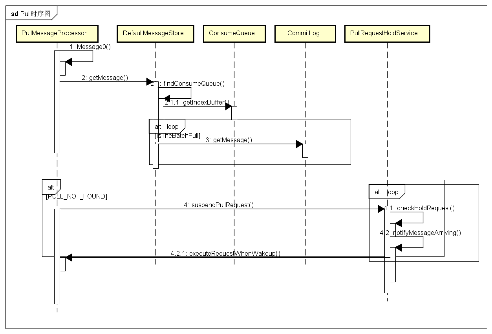

# RocketMQ源码分析之Message拉取与消费

通过前面的章节我们知道RocketMQ会将消息存储到CommitLog中,这里将介绍如何将消息提供给消费者消费

## Reput生成Index和写入ConsumeQueue

### ReputMessageService


可以看到ReputMessageService其实是一个线程,它的作用是通过不断循环来判断是否存在新的消息存入CommitLog


Thread的Run方法会调用deReput方法

#### org.apache.rocketmq.store.DefaultMessageStore.ReputMessageService#doReput

```
private void doReput() {
            if (this.reputFromOffset < DefaultMessageStore.this.commitLog.getMinOffset()) {
                log.warn("The reputFromOffset={} is smaller than minPyOffset={}, this usually indicate that the dispatch behind too much and the commitlog has expired.",
                    this.reputFromOffset, DefaultMessageStore.this.commitLog.getMinOffset());
                this.reputFromOffset = DefaultMessageStore.this.commitLog.getMinOffset();
            }
            for (boolean doNext = true; this.isCommitLogAvailable() && doNext; ) {
                ///...
                    
                // 获取从reputFromOffset开始的commitLog对应的MappeFile对应的MappedByteBuffer
                SelectMappedBufferResult result = DefaultMessageStore.this.commitLog.getData(reputFromOffset);
                if (result != null) {
                    try {
                        this.reputFromOffset = result.getStartOffset();

                        for (int readSize = 0; readSize < result.getSize() && doNext; ) {
                 // 获得一条可以被reput的Message,并封装成请求
                            DispatchRequest dispatchRequest =
                                DefaultMessageStore.this.commitLog.checkMessageAndReturnSize(result.getByteBuffer(), false, false);
                            int size = dispatchRequest.getBufferSize() == -1 ? dispatchRequest.getMsgSize() : dispatchRequest.getBufferSize();

                            if (dispatchRequest.isSuccess()) {
                                if (size > 0) {
                                        //开始执行任务
                                    DefaultMessageStore.this.doDispatch(dispatchRequest);

                                    ///...
                                   
                                } else if (size == 0) {
                                    this.reputFromOffset = DefaultMessageStore.this.commitLog.rollNextFile(this.reputFromOffset);
                                    readSize = result.getSize();
                                }
                            }
                            ///...
                            }
                        }
                    } finally {
                        result.release();
                    }
                } else {
                    doNext = false;
                }
            }
        }
```


```
 public void doDispatch(DispatchRequest req) {
        for (CommitLogDispatcher dispatcher : this.dispatcherList) {
            dispatcher.dispatch(req);
        }
    }
```

这里可以看到有两个CommitLogDispatcher一个是用来写入ConmsueQueue,一个是用来写入Index


#### CommitLogDispatcherBuildConsumeQueue

```
class CommitLogDispatcherBuildConsumeQueue implements CommitLogDispatcher {

        @Override
        public void dispatch(DispatchRequest request) {
            final int tranType = MessageSysFlag.getTransactionValue(request.getSysFlag());
            switch (tranType) {
                case MessageSysFlag.TRANSACTION_NOT_TYPE:
                case MessageSysFlag.TRANSACTION_COMMIT_TYPE:
                    DefaultMessageStore.this.putMessagePositionInfo(request);
                    break;
                case MessageSysFlag.TRANSACTION_PREPARED_TYPE:
                case MessageSysFlag.TRANSACTION_ROLLBACK_TYPE:
                    break;
            }
        }
    }
```

步步DEBUG,里面会调用ConsumeQueue的核心代码

#### org.apache.rocketmq.store.ConsumeQueue#putMessagePositionInfo

```
private boolean putMessagePositionInfo(final long offset, final int size, final long tagsCode,
        final long cqOffset) {

        if (offset + size <= this.maxPhysicOffset) {
            log.warn("Maybe try to build consume queue repeatedly maxPhysicOffset={} phyOffset={}", maxPhysicOffset, offset);
            return true;
        }
        // 写入位置信息到byteBuffer
        this.byteBufferIndex.flip();
        this.byteBufferIndex.limit(CQ_STORE_UNIT_SIZE);
        this.byteBufferIndex.putLong(offset);
        this.byteBufferIndex.putInt(size);
        this.byteBufferIndex.putLong(tagsCode);
        // 计算consumeQueue存储位置，并获得对应的MappedFile
        final long expectLogicOffset = cqOffset * CQ_STORE_UNIT_SIZE;
    
        MappedFile mappedFile = this.mappedFileQueue.getLastMappedFile(expectLogicOffset);
        if (mappedFile != null) {

            if (mappedFile.isFirstCreateInQueue() && cqOffset != 0 && mappedFile.getWrotePosition() == 0) {
                this.minLogicOffset = expectLogicOffset;
                this.mappedFileQueue.setFlushedWhere(expectLogicOffset);
                this.mappedFileQueue.setCommittedWhere(expectLogicOffset);
                this.fillPreBlank(mappedFile, expectLogicOffset);
                log.info("fill pre blank space " + mappedFile.getFileName() + " " + expectLogicOffset + " "
                    + mappedFile.getWrotePosition());
            }

            if (cqOffset != 0) {
                long currentLogicOffset = mappedFile.getWrotePosition() + mappedFile.getFileFromOffset();

                if (expectLogicOffset < currentLogicOffset) {
                    log.warn("Build  consume queue repeatedly, expectLogicOffset: {} currentLogicOffset: {} Topic: {} QID: {} Diff: {}",
                        expectLogicOffset, currentLogicOffset, this.topic, this.queueId, expectLogicOffset - currentLogicOffset);
                    return true;
                }

                if (expectLogicOffset != currentLogicOffset) {
                    LOG_ERROR.warn(
                        "[BUG]logic queue order maybe wrong, expectLogicOffset: {} currentLogicOffset: {} Topic: {} QID: {} Diff: {}",
                        expectLogicOffset,
                        currentLogicOffset,
                        this.topic,
                        this.queueId,
                        expectLogicOffset - currentLogicOffset
                    );
                }
            }
            // 设置commitLog重放消息到ConsumeQueue位置。
            this.maxPhysicOffset = offset + size;
            // 插入mappedFile
            return mappedFile.appendMessage(this.byteBufferIndex.array());
        }
        return false;
    }
```


#### CommitLogDispatcherBuildIndex

```
class CommitLogDispatcherBuildIndex implements CommitLogDispatcher {

        @Override
        public void dispatch(DispatchRequest request) {
            if (DefaultMessageStore.this.messageStoreConfig.isMessageIndexEnable()) {
                DefaultMessageStore.this.indexService.buildIndex(request);
            }
        }
    }
```


核心代码

#### org.apache.rocketmq.store.index.IndexService#buildIndex

```
public void buildIndex(DispatchRequest req) {
        //  获得IndexFile
        IndexFile indexFile = retryGetAndCreateIndexFile();
        if (indexFile != null) {
            long endPhyOffset = indexFile.getEndPhyOffset();
            DispatchRequest msg = req;
            String topic = msg.getTopic();
            String keys = msg.getKeys();
            if (msg.getCommitLogOffset() < endPhyOffset) {
                return;
            }

            final int tranType = MessageSysFlag.getTransactionValue(msg.getSysFlag());
            switch (tranType) {
                case MessageSysFlag.TRANSACTION_NOT_TYPE:
                case MessageSysFlag.TRANSACTION_PREPARED_TYPE:
                case MessageSysFlag.TRANSACTION_COMMIT_TYPE:
                    break;
                case MessageSysFlag.TRANSACTION_ROLLBACK_TYPE:
                    return;
            }

            if (req.getUniqKey() != null) {
              //将消息存储核心位置
                indexFile = putKey(indexFile, msg, buildKey(topic, req.getUniqKey()));
                if (indexFile == null) {
                    log.error("putKey error commitlog {} uniqkey {}", req.getCommitLogOffset(), req.getUniqKey());
                    return;
                }
            }

            if (keys != null && keys.length() > 0) {
                String[] keyset = keys.split(MessageConst.KEY_SEPARATOR);
                for (int i = 0; i < keyset.length; i++) {
                    String key = keyset[i];
                    if (key.length() > 0) {
                        indexFile = putKey(indexFile, msg, buildKey(topic, key));
                        if (indexFile == null) {
                            log.error("putKey error commitlog {} uniqkey {}", req.getCommitLogOffset(), req.getUniqKey());
                            return;
                        }
                    }
                }
            }
        } else {
            log.error("build index error, stop building index");
        }
    }
```


#### org.apache.rocketmq.store.index.IndexFile#putKey

```
public boolean putKey(final String key, final long phyOffset, final long storeTimestamp) {
        if (this.indexHeader.getIndexCount() < this.indexNum) {
            //拿到对应的Hash值
            int keyHash = indexKeyHashMethod(key);
            //找到对应的slot
            int slotPos = keyHash % this.hashSlotNum;
            //根据单位Slot大小找到具体Slot位置
            int absSlotPos = IndexHeader.INDEX_HEADER_SIZE + slotPos * hashSlotSize;

            FileLock fileLock = null;

            try {

                //
                int slotValue = this.mappedByteBuffer.getInt(absSlotPos);
                if (slotValue <= invalidIndex || slotValue > this.indexHeader.getIndexCount()) {
                    slotValue = invalidIndex;
                }

                long timeDiff = storeTimestamp - this.indexHeader.getBeginTimestamp();

                timeDiff = timeDiff / 1000;

                if (this.indexHeader.getBeginTimestamp() <= 0) {
                    timeDiff = 0;
                } else if (timeDiff > Integer.MAX_VALUE) {
                    timeDiff = Integer.MAX_VALUE;
                } else if (timeDiff < 0) {
                    timeDiff = 0;
                }

                int absIndexPos =
                    IndexHeader.INDEX_HEADER_SIZE + this.hashSlotNum * hashSlotSize
                        + this.indexHeader.getIndexCount() * indexSize;
                //把消息存储到MappedFile
                this.mappedByteBuffer.putInt(absIndexPos, keyHash);
                this.mappedByteBuffer.putLong(absIndexPos + 4, phyOffset);
                this.mappedByteBuffer.putInt(absIndexPos + 4 + 8, (int) timeDiff);
                this.mappedByteBuffer.putInt(absIndexPos + 4 + 8 + 4, slotValue);
                //最后会存放indexFile的冲突Index位置以链式连接
                this.mappedByteBuffer.putInt(absSlotPos, this.indexHeader.getIndexCount());

               
                ///...

                return true;
            } 
        } 
        return false;
    }
```


#### FlushConsumeQueueService


同样可以看到FlushConsumeQueueService也是通过循环来不断刷盘


```
class FlushConsumeQueueService extends ServiceThread {
        private static final int RETRY_TIMES_OVER = 3;
        private long lastFlushTimestamp = 0;

        private void doFlush(int retryTimes) {
            int flushConsumeQueueLeastPages = DefaultMessageStore.this.getMessageStoreConfig().getFlushConsumeQueueLeastPages();

            if (retryTimes == RETRY_TIMES_OVER) {
                flushConsumeQueueLeastPages = 0;
            }

            long logicsMsgTimestamp = 0;

            int flushConsumeQueueThoroughInterval = DefaultMessageStore.this.getMessageStoreConfig().getFlushConsumeQueueThoroughInterval();
            long currentTimeMillis = System.currentTimeMillis();
            //如果时间已经到了刷盘的期限
            if (currentTimeMillis >= (this.lastFlushTimestamp + flushConsumeQueueThoroughInterval)) {
                this.lastFlushTimestamp = currentTimeMillis;
                flushConsumeQueueLeastPages = 0;
                logicsMsgTimestamp = DefaultMessageStore.this.getStoreCheckpoint().getLogicsMsgTimestamp();
            }

            ConcurrentMap<String, ConcurrentMap<Integer, ConsumeQueue>> tables = DefaultMessageStore.this.consumeQueueTable;
            //通过获得ConsumeQueue来刷盘
            for (ConcurrentMap<Integer, ConsumeQueue> maps : tables.values()) {
                for (ConsumeQueue cq : maps.values()) {
                    boolean result = false;
                    for (int i = 0; i < retryTimes && !result; i++) {
                        result = cq.flush(flushConsumeQueueLeastPages);
                    }
                }
            }

            if (0 == flushConsumeQueueLeastPages) {
                if (logicsMsgTimestamp > 0) {
                    DefaultMessageStore.this.getStoreCheckpoint().setLogicsMsgTimestamp(logicsMsgTimestamp);
                }
                DefaultMessageStore.this.getStoreCheckpoint().flush();
            }
        }
```


Reput总结一下


## Broker接受Pull请求


通过Netty接受Pull请求


```
private RemotingCommand processRequest(final Channel channel, RemotingCommand request, boolean brokerAllowSuspend)
        throws RemotingCommandException {
        //生成响应
        RemotingCommand response = RemotingCommand.createResponseCommand(PullMessageResponseHeader.class);
        final PullMessageResponseHeader responseHeader = (PullMessageResponseHeader) response.readCustomHeader();
        final PullMessageRequestHeader requestHeader =
            (PullMessageRequestHeader) request.decodeCommandCustomHeader(PullMessageRequestHeader.class);

        response.setOpaque(request.getOpaque());

        log.debug("receive PullMessage request command, {}", request);

        if (!PermName.isReadable(this.brokerController.getBrokerConfig().getBrokerPermission())) {
            response.setCode(ResponseCode.NO_PERMISSION);
            response.setRemark(String.format("the broker[%s] pulling message is forbidden", this.brokerController.getBrokerConfig().getBrokerIP1()));
            return response;
        }
        //判断组是否存在
        SubscriptionGroupConfig subscriptionGroupConfig =
            this.brokerController.getSubscriptionGroupManager().findSubscriptionGroupConfig(requestHeader.getConsumerGroup());
        if (null == subscriptionGroupConfig) {
            response.setCode(ResponseCode.SUBSCRIPTION_GROUP_NOT_EXIST);
            response.setRemark(String.format("subscription group [%s] does not exist, %s", requestHeader.getConsumerGroup(), FAQUrl.suggestTodo(FAQUrl.SUBSCRIPTION_GROUP_NOT_EXIST)));
            return response;
        }
        
        if (!subscriptionGroupConfig.isConsumeEnable()) {
            response.setCode(ResponseCode.NO_PERMISSION);
            response.setRemark("subscription group no permission, " + requestHeader.getConsumerGroup());
            return response;
        }

        final boolean hasSuspendFlag = PullSysFlag.hasSuspendFlag(requestHeader.getSysFlag());
        final boolean hasCommitOffsetFlag = PullSysFlag.hasCommitOffsetFlag(requestHeader.getSysFlag());
        final boolean hasSubscriptionFlag = PullSysFlag.hasSubscriptionFlag(requestHeader.getSysFlag());

        final long suspendTimeoutMillisLong = hasSuspendFlag ? requestHeader.getSuspendTimeoutMillis() : 0;
        //判断组是否存在
        TopicConfig topicConfig = this.brokerController.getTopicConfigManager().selectTopicConfig(requestHeader.getTopic());
        if (null == topicConfig) {
            log.error("the topic {} not exist, consumer: {}", requestHeader.getTopic(), RemotingHelper.parseChannelRemoteAddr(channel));
            response.setCode(ResponseCode.TOPIC_NOT_EXIST);
            response.setRemark(String.format("topic[%s] not exist, apply first please! %s", requestHeader.getTopic(), FAQUrl.suggestTodo(FAQUrl.APPLY_TOPIC_URL)));
            return response;
        }

        if (!PermName.isReadable(topicConfig.getPerm())) {
            response.setCode(ResponseCode.NO_PERMISSION);
            response.setRemark("the topic[" + requestHeader.getTopic() + "] pulling message is forbidden");
            return response;
        }
        // 校验 读取队列 在 topic配置 队列范围内
        if (requestHeader.getQueueId() < 0 || requestHeader.getQueueId() >= topicConfig.getReadQueueNums()) {
            String errorInfo = String.format("queueId[%d] is illegal, topic:[%s] topicConfig.readQueueNums:[%d] consumer:[%s]",
                requestHeader.getQueueId(), requestHeader.getTopic(), topicConfig.getReadQueueNums(), channel.remoteAddress());
            log.warn(errorInfo);
            response.setCode(ResponseCode.SYSTEM_ERROR);
            response.setRemark(errorInfo);
            return response;
        }

        SubscriptionData subscriptionData = null;
        ConsumerFilterData consumerFilterData = null;
        // 校验 订阅关系
        if (hasSubscriptionFlag) {
            try {
                subscriptionData = FilterAPI.build(
                    requestHeader.getTopic(), requestHeader.getSubscription(), requestHeader.getExpressionType()
                );
                if (!ExpressionType.isTagType(subscriptionData.getExpressionType())) {
                    consumerFilterData = ConsumerFilterManager.build(
                        requestHeader.getTopic(), requestHeader.getConsumerGroup(), requestHeader.getSubscription(),
                        requestHeader.getExpressionType(), requestHeader.getSubVersion()
                    );
                    assert consumerFilterData != null;
                }
            } catch (Exception e) {
                log.warn("Parse the consumer's subscription[{}] failed, group: {}", requestHeader.getSubscription(),
                    requestHeader.getConsumerGroup());
                response.setCode(ResponseCode.SUBSCRIPTION_PARSE_FAILED);
                response.setRemark("parse the consumer's subscription failed");
                return response;
            }
        } else {
            // 校验 消费分组信息 是否存在
            ConsumerGroupInfo consumerGroupInfo =
                this.brokerController.getConsumerManager().getConsumerGroupInfo(requestHeader.getConsumerGroup());
            if (null == consumerGroupInfo) {
                log.warn("the consumer's group info not exist, group: {}", requestHeader.getConsumerGroup());
                response.setCode(ResponseCode.SUBSCRIPTION_NOT_EXIST);
                response.setRemark("the consumer's group info not exist" + FAQUrl.suggestTodo(FAQUrl.SAME_GROUP_DIFFERENT_TOPIC));
                return response;
            }
            // 校验 消费分组信息 消息模型是否匹配
            if (!subscriptionGroupConfig.isConsumeBroadcastEnable()
                && consumerGroupInfo.getMessageModel() == MessageModel.BROADCASTING) {
                response.setCode(ResponseCode.NO_PERMISSION);
                response.setRemark("the consumer group[" + requestHeader.getConsumerGroup() + "] can not consume by broadcast way");
                return response;
            }
            // 校验 订阅信息 是否存在
            subscriptionData = consumerGroupInfo.findSubscriptionData(requestHeader.getTopic());
            if (null == subscriptionData) {
                log.warn("the consumer's subscription not exist, group: {}, topic:{}", requestHeader.getConsumerGroup(), requestHeader.getTopic());
                response.setCode(ResponseCode.SUBSCRIPTION_NOT_EXIST);
                response.setRemark("the consumer's subscription not exist" + FAQUrl.suggestTodo(FAQUrl.SAME_GROUP_DIFFERENT_TOPIC));
                return response;
            }
            // 校验 订阅信息版本 是否合法
            if (subscriptionData.getSubVersion() < requestHeader.getSubVersion()) {
                log.warn("The broker's subscription is not latest, group: {} {}", requestHeader.getConsumerGroup(),
                    subscriptionData.getSubString());
                response.setCode(ResponseCode.SUBSCRIPTION_NOT_LATEST);
                response.setRemark("the consumer's subscription not latest");
                return response;
            }
            if (!ExpressionType.isTagType(subscriptionData.getExpressionType())) {
                consumerFilterData = this.brokerController.getConsumerFilterManager().get(requestHeader.getTopic(),
                    requestHeader.getConsumerGroup());
                if (consumerFilterData == null) {
                    response.setCode(ResponseCode.FILTER_DATA_NOT_EXIST);
                    response.setRemark("The broker's consumer filter data is not exist!Your expression may be wrong!");
                    return response;
                }
                if (consumerFilterData.getClientVersion() < requestHeader.getSubVersion()) {
                    log.warn("The broker's consumer filter data is not latest, group: {}, topic: {}, serverV: {}, clientV: {}",
                        requestHeader.getConsumerGroup(), requestHeader.getTopic(), consumerFilterData.getClientVersion(), requestHeader.getSubVersion());
                    response.setCode(ResponseCode.FILTER_DATA_NOT_LATEST);
                    response.setRemark("the consumer's consumer filter data not latest");
                    return response;
                }
            }
        }

        if (!ExpressionType.isTagType(subscriptionData.getExpressionType())
            && !this.brokerController.getBrokerConfig().isEnablePropertyFilter()) {
            response.setCode(ResponseCode.SYSTEM_ERROR);
            response.setRemark("The broker does not support consumer to filter message by " + subscriptionData.getExpressionType());
            return response;
        }

        MessageFilter messageFilter;
        if (this.brokerController.getBrokerConfig().isFilterSupportRetry()) {
            messageFilter = new ExpressionForRetryMessageFilter(subscriptionData, consumerFilterData,
                this.brokerController.getConsumerFilterManager());
        } else {
            messageFilter = new ExpressionMessageFilter(subscriptionData, consumerFilterData,
                this.brokerController.getConsumerFilterManager());
        }
        //// 获取消息
        final GetMessageResult getMessageResult =
            this.brokerController.getMessageStore().getMessage(requestHeader.getConsumerGroup(), requestHeader.getTopic(),
                requestHeader.getQueueId(), requestHeader.getQueueOffset(), requestHeader.getMaxMsgNums(), messageFilter);
        if (getMessageResult != null) {
            response.setRemark(getMessageResult.getStatus().name());
            responseHeader.setNextBeginOffset(getMessageResult.getNextBeginOffset());
            responseHeader.setMinOffset(getMessageResult.getMinOffset());
            responseHeader.setMaxOffset(getMessageResult.getMaxOffset());

            if (getMessageResult.isSuggestPullingFromSlave()) {
                responseHeader.setSuggestWhichBrokerId(subscriptionGroupConfig.getWhichBrokerWhenConsumeSlowly());
            } else {
                responseHeader.setSuggestWhichBrokerId(MixAll.MASTER_ID);
            }

            switch (this.brokerController.getMessageStoreConfig().getBrokerRole()) {
                case ASYNC_MASTER:
                case SYNC_MASTER:
                    break;
                case SLAVE:
                    if (!this.brokerController.getBrokerConfig().isSlaveReadEnable()) {
                        response.setCode(ResponseCode.PULL_RETRY_IMMEDIATELY);
                        responseHeader.setSuggestWhichBrokerId(MixAll.MASTER_ID);
                    }
                    break;
            }

            if (this.brokerController.getBrokerConfig().isSlaveReadEnable()) {
                // consume too slow ,redirect to another machine
                if (getMessageResult.isSuggestPullingFromSlave()) {
                    responseHeader.setSuggestWhichBrokerId(subscriptionGroupConfig.getWhichBrokerWhenConsumeSlowly());
                }
                // consume ok
                else {
                    responseHeader.setSuggestWhichBrokerId(subscriptionGroupConfig.getBrokerId());
                }
            } else {
                responseHeader.setSuggestWhichBrokerId(MixAll.MASTER_ID);
            }
            //根据结果设置状态码
            switch (getMessageResult.getStatus()) {
                case FOUND:
                    response.setCode(ResponseCode.SUCCESS);
                    break;
                case MESSAGE_WAS_REMOVING:
                    response.setCode(ResponseCode.PULL_RETRY_IMMEDIATELY);
                    break;
                case NO_MATCHED_LOGIC_QUEUE:
                case NO_MESSAGE_IN_QUEUE:
                    if (0 != requestHeader.getQueueOffset()) {
                        response.setCode(ResponseCode.PULL_OFFSET_MOVED);

                        // XXX: warn and notify me
                        log.info("the broker store no queue data, fix the request offset {} to {}, Topic: {} QueueId: {} Consumer Group: {}",
                            requestHeader.getQueueOffset(),
                            getMessageResult.getNextBeginOffset(),
                            requestHeader.getTopic(),
                            requestHeader.getQueueId(),
                            requestHeader.getConsumerGroup()
                        );
                    } else {
                        response.setCode(ResponseCode.PULL_NOT_FOUND);
                    }
                    break;
                case NO_MATCHED_MESSAGE:
                    response.setCode(ResponseCode.PULL_RETRY_IMMEDIATELY);
                    break;
                case OFFSET_FOUND_NULL:
                    response.setCode(ResponseCode.PULL_NOT_FOUND);
                    break;
                case OFFSET_OVERFLOW_BADLY:
                    response.setCode(ResponseCode.PULL_OFFSET_MOVED);
                    // XXX: warn and notify me
                    log.info("the request offset: {} over flow badly, broker max offset: {}, consumer: {}",
                        requestHeader.getQueueOffset(), getMessageResult.getMaxOffset(), channel.remoteAddress());
                    break;
                case OFFSET_OVERFLOW_ONE:
                    response.setCode(ResponseCode.PULL_NOT_FOUND);
                    break;
                case OFFSET_TOO_SMALL:
                    response.setCode(ResponseCode.PULL_OFFSET_MOVED);
                    log.info("the request offset too small. group={}, topic={}, requestOffset={}, brokerMinOffset={}, clientIp={}",
                        requestHeader.getConsumerGroup(), requestHeader.getTopic(), requestHeader.getQueueOffset(),
                        getMessageResult.getMinOffset(), channel.remoteAddress());
                    break;
                default:
                    assert false;
                    break;
            }

            if (this.hasConsumeMessageHook()) {
                ConsumeMessageContext context = new ConsumeMessageContext();
                context.setConsumerGroup(requestHeader.getConsumerGroup());
                context.setTopic(requestHeader.getTopic());
                context.setQueueId(requestHeader.getQueueId());

                String owner = request.getExtFields().get(BrokerStatsManager.COMMERCIAL_OWNER);

                switch (response.getCode()) {
                    case ResponseCode.SUCCESS:
                        int commercialBaseCount = brokerController.getBrokerConfig().getCommercialBaseCount();
                        int incValue = getMessageResult.getMsgCount4Commercial() * commercialBaseCount;

                        context.setCommercialRcvStats(BrokerStatsManager.StatsType.RCV_SUCCESS);
                        context.setCommercialRcvTimes(incValue);
                        context.setCommercialRcvSize(getMessageResult.getBufferTotalSize());
                        context.setCommercialOwner(owner);

                        break;
                    case ResponseCode.PULL_NOT_FOUND:
                        if (!brokerAllowSuspend) {

                            context.setCommercialRcvStats(BrokerStatsManager.StatsType.RCV_EPOLLS);
                            context.setCommercialRcvTimes(1);
                            context.setCommercialOwner(owner);

                        }
                        break;
                    case ResponseCode.PULL_RETRY_IMMEDIATELY:
                    case ResponseCode.PULL_OFFSET_MOVED:
                        context.setCommercialRcvStats(BrokerStatsManager.StatsType.RCV_EPOLLS);
                        context.setCommercialRcvTimes(1);
                        context.setCommercialOwner(owner);
                        break;
                    default:
                        assert false;
                        break;
                }

                this.executeConsumeMessageHookBefore(context);
            }

            switch (response.getCode()) {
                case ResponseCode.SUCCESS:

                    this.brokerController.getBrokerStatsManager().incGroupGetNums(requestHeader.getConsumerGroup(), requestHeader.getTopic(),
                        getMessageResult.getMessageCount());

                    this.brokerController.getBrokerStatsManager().incGroupGetSize(requestHeader.getConsumerGroup(), requestHeader.getTopic(),
                        getMessageResult.getBufferTotalSize());

                    this.brokerController.getBrokerStatsManager().incBrokerGetNums(getMessageResult.getMessageCount());
                    if (this.brokerController.getBrokerConfig().isTransferMsgByHeap()) {
                        final long beginTimeMills = this.brokerController.getMessageStore().now();
                        final byte[] r = this.readGetMessageResult(getMessageResult, requestHeader.getConsumerGroup(), requestHeader.getTopic(), requestHeader.getQueueId());
                        this.brokerController.getBrokerStatsManager().incGroupGetLatency(requestHeader.getConsumerGroup(),
                            requestHeader.getTopic(), requestHeader.getQueueId(),
                            (int) (this.brokerController.getMessageStore().now() - beginTimeMills));
                        response.setBody(r);
                    } else {
                   //零拷贝
                        try {
                            FileRegion fileRegion =
                                new ManyMessageTransfer(response.encodeHeader(getMessageResult.getBufferTotalSize()), getMessageResult);
                            channel.writeAndFlush(fileRegion).addListener(new ChannelFutureListener() {
                                @Override
                                public void operationComplete(ChannelFuture future) throws Exception {
                                    getMessageResult.release();
                                    if (!future.isSuccess()) {
                                        log.error("transfer many message by pagecache failed, {}", channel.remoteAddress(), future.cause());
                                    }
                                }
                            });
                        } catch (Throwable e) {
                            log.error("transfer many message by pagecache exception", e);
                            getMessageResult.release();
                        }

                        response = null;
                    }
                    break;
                    // 消息未查询到 && broker允许挂起请求 && 请求允许挂起
                case ResponseCode.PULL_NOT_FOUND:
                    if (brokerAllowSuspend && hasSuspendFlag) {
                        long pollingTimeMills = suspendTimeoutMillisLong;
                        if (!this.brokerController.getBrokerConfig().isLongPollingEnable()) {
                            pollingTimeMills = this.brokerController.getBrokerConfig().getShortPollingTimeMills();
                        }

                        String topic = requestHeader.getTopic();
                        long offset = requestHeader.getQueueOffset();
                        int queueId = requestHeader.getQueueId();
                        PullRequest pullRequest = new PullRequest(request, channel, pollingTimeMills,
                            this.brokerController.getMessageStore().now(), offset, subscriptionData, messageFilter);
                        this.brokerController.getPullRequestHoldService().suspendPullRequest(topic, queueId, pullRequest);
                        response = null;
                        break;
                    }

                case ResponseCode.PULL_RETRY_IMMEDIATELY:
                    break;
                case ResponseCode.PULL_OFFSET_MOVED:
                    if (this.brokerController.getMessageStoreConfig().getBrokerRole() != BrokerRole.SLAVE
                        || this.brokerController.getMessageStoreConfig().isOffsetCheckInSlave()) {
                        MessageQueue mq = new MessageQueue();
                        mq.setTopic(requestHeader.getTopic());
                        mq.setQueueId(requestHeader.getQueueId());
                        mq.setBrokerName(this.brokerController.getBrokerConfig().getBrokerName());

                        OffsetMovedEvent event = new OffsetMovedEvent();
                        event.setConsumerGroup(requestHeader.getConsumerGroup());
                        event.setMessageQueue(mq);
                        event.setOffsetRequest(requestHeader.getQueueOffset());
                        event.setOffsetNew(getMessageResult.getNextBeginOffset());
                        this.generateOffsetMovedEvent(event);
                        log.warn(
                            "PULL_OFFSET_MOVED:correction offset. topic={}, groupId={}, requestOffset={}, newOffset={}, suggestBrokerId={}",
                            requestHeader.getTopic(), requestHeader.getConsumerGroup(), event.getOffsetRequest(), event.getOffsetNew(),
                            responseHeader.getSuggestWhichBrokerId());
                    } else {
                        responseHeader.setSuggestWhichBrokerId(subscriptionGroupConfig.getBrokerId());
                        response.setCode(ResponseCode.PULL_RETRY_IMMEDIATELY);
                        log.warn("PULL_OFFSET_MOVED:none correction. topic={}, groupId={}, requestOffset={}, suggestBrokerId={}",
                            requestHeader.getTopic(), requestHeader.getConsumerGroup(), requestHeader.getQueueOffset(),
                            responseHeader.getSuggestWhichBrokerId());
                    }

                    break;
                default:
                    assert false;
            }
        } else {
            response.setCode(ResponseCode.SYSTEM_ERROR);
            response.setRemark("store getMessage return null");
        }
        //请求要求持久化进度
        boolean storeOffsetEnable = brokerAllowSuspend;
        storeOffsetEnable = storeOffsetEnable && hasCommitOffsetFlag;
        storeOffsetEnable = storeOffsetEnable
            && this.brokerController.getMessageStoreConfig().getBrokerRole() != BrokerRole.SLAVE;
        if (storeOffsetEnable) {
            this.brokerController.getConsumerOffsetManager().commitOffset(RemotingHelper.parseChannelRemoteAddr(channel),
                requestHeader.getConsumerGroup(), requestHeader.getTopic(), requestHeader.getQueueId(), requestHeader.getCommitOffset());
        }
        return response;
    }
```

对于拉取流程来说,这里的核心就是MessageStore的getMessage方法


#### org.apache.rocketmq.store.DefaultMessageStore#getMessage


```
public GetMessageResult getMessage(final String group, final String topic, final int queueId, final long offset,
        final int maxMsgNums,
        final MessageFilter messageFilter) {
        if (this.shutdown) {
            log.warn("message store has shutdown, so getMessage is forbidden");
            return null;
        }

        if (!this.runningFlags.isReadable()) {
            log.warn("message store is not readable, so getMessage is forbidden " + this.runningFlags.getFlagBits());
            return null;
        }

        long beginTime = this.getSystemClock().now();

        GetMessageStatus status = GetMessageStatus.NO_MESSAGE_IN_QUEUE;
        long nextBeginOffset = offset;
        long minOffset = 0;
        long maxOffset = 0;

        GetMessageResult getResult = new GetMessageResult();

        final long maxOffsetPy = this.commitLog.getMaxOffset();
        // 获取消费队列
        ConsumeQueue consumeQueue = findConsumeQueue(topic, queueId);
        if (consumeQueue != null) {
            minOffset = consumeQueue.getMinOffsetInQueue();
            maxOffset = consumeQueue.getMaxOffsetInQueue();
            // 判断 队列位置(offset)
            if (maxOffset == 0) {
                status = GetMessageStatus.NO_MESSAGE_IN_QUEUE;
                nextBeginOffset = nextOffsetCorrection(offset, 0);
            } else if (offset < minOffset) {
                status = GetMessageStatus.OFFSET_TOO_SMALL;
                nextBeginOffset = nextOffsetCorrection(offset, minOffset);
            } else if (offset == maxOffset) {
                status = GetMessageStatus.OFFSET_OVERFLOW_ONE;
                nextBeginOffset = nextOffsetCorrection(offset, offset);
            } else if (offset > maxOffset) {
                status = GetMessageStatus.OFFSET_OVERFLOW_BADLY;
                if (0 == minOffset) {
                    nextBeginOffset = nextOffsetCorrection(offset, minOffset);
                } else {
                    nextBeginOffset = nextOffsetCorrection(offset, maxOffset);
                }
            } else {
                获得 映射Buffer结果(MappedFile)
                SelectMappedBufferResult bufferConsumeQueue = consumeQueue.getIndexBuffer(offset);
                if (bufferConsumeQueue != null) {
                    try {
                        status = GetMessageStatus.NO_MATCHED_MESSAGE;

                        long nextPhyFileStartOffset = Long.MIN_VALUE;
                        long maxPhyOffsetPulling = 0;

                        int i = 0;
                        final int maxFilterMessageCount = Math.max(16000, maxMsgNums * ConsumeQueue.CQ_STORE_UNIT_SIZE);
                        final boolean diskFallRecorded = this.messageStoreConfig.isDiskFallRecorded();
                        ConsumeQueueExt.CqExtUnit cqExtUnit = new ConsumeQueueExt.CqExtUnit();
                        // 循环获取 消息位置信息
                        for (; i < bufferConsumeQueue.getSize() && i < maxFilterMessageCount; i += ConsumeQueue.CQ_STORE_UNIT_SIZE) {
                            // 消息物理位置offset
                               long offsetPy = bufferConsumeQueue.getByteBuffer().getLong();
                            // 消息长度
                          int sizePy = bufferConsumeQueue.getByteBuffer().getInt(); 
                            // 消息tagsCode
                          long tagsCode = bufferConsumeQueue.getByteBuffer().getLong(); 

                            maxPhyOffsetPulling = offsetPy;

                            if (nextPhyFileStartOffset != Long.MIN_VALUE) {
                                if (offsetPy < nextPhyFileStartOffset)
                                    continue;
                            }
                            //查看是否可以全部放在内存中
                            boolean isInDisk = checkInDiskByCommitOffset(offsetPy, maxOffsetPy);

                            if (this.isTheBatchFull(sizePy, maxMsgNums, getResult.getBufferTotalSize(), getResult.getMessageCount(),
                                isInDisk)) {
                                break;
                            }

                            boolean extRet = false, isTagsCodeLegal = true;
                            if (consumeQueue.isExtAddr(tagsCode)) {
                                extRet = consumeQueue.getExt(tagsCode, cqExtUnit);
                                if (extRet) {
                                    tagsCode = cqExtUnit.getTagsCode();
                                } else {
                                    // can't find ext content.Client will filter messages by tag also.
                                    log.error("[BUG] can't find consume queue extend file content!addr={}, offsetPy={}, sizePy={}, topic={}, group={}",
                                        tagsCode, offsetPy, sizePy, topic, group);
                                    isTagsCodeLegal = false;
                                }
                            }

                            if (messageFilter != null
                                && !messageFilter.isMatchedByConsumeQueue(isTagsCodeLegal ? tagsCode : null, extRet ? cqExtUnit : null)) {
                                if (getResult.getBufferTotalSize() == 0) {
                                    status = GetMessageStatus.NO_MATCHED_MESSAGE;
                                }

                                continue;
                            }
                            //获得消息
                            SelectMappedBufferResult selectResult = this.commitLog.getMessage(offsetPy, sizePy);
                            if (null == selectResult) {
                                if (getResult.getBufferTotalSize() == 0) {
                                    status = GetMessageStatus.MESSAGE_WAS_REMOVING;
                                }

                                nextPhyFileStartOffset = this.commitLog.rollNextFile(offsetPy);
                                continue;
                            }

                            if (messageFilter != null
                                && !messageFilter.isMatchedByCommitLog(selectResult.getByteBuffer().slice(), null)) {
                                if (getResult.getBufferTotalSize() == 0) {
                                    status = GetMessageStatus.NO_MATCHED_MESSAGE;
                                }
                                // release...
                                selectResult.release();
                                continue;
                            }
                            //服务存放成功统计
                            this.storeStatsService.getGetMessageTransferedMsgCount().incrementAndGet();
                            将消息写入结果
                            getResult.addMessage(selectResult);
                            status = GetMessageStatus.FOUND;
                            nextPhyFileStartOffset = Long.MIN_VALUE;
                        }

                        if (diskFallRecorded) {
                            long fallBehind = maxOffsetPy - maxPhyOffsetPulling;
                            brokerStatsManager.recordDiskFallBehindSize(group, topic, queueId, fallBehind);
                        }
                        //计算已经从ConsumeQueue读到哪里了
                        nextBeginOffset = offset + (i / ConsumeQueue.CQ_STORE_UNIT_SIZE);
                        //如果超过内存中保存的,会建议从从结点去拉
                        long diff = maxOffsetPy - maxPhyOffsetPulling;
                        long memory = (long) (StoreUtil.TOTAL_PHYSICAL_MEMORY_SIZE
                            * (this.messageStoreConfig.getAccessMessageInMemoryMaxRatio() / 100.0));
                        getResult.setSuggestPullingFromSlave(diff > memory);
                    } finally {
                        bufferConsumeQueue.release();
                    }
                } else {
                    status = GetMessageStatus.OFFSET_FOUND_NULL;
                    nextBeginOffset = nextOffsetCorrection(offset, consumeQueue.rollNextFile(offset));
                    log.warn("consumer request topic: " + topic + "offset: " + offset + " minOffset: " + minOffset + " maxOffset: "
                        + maxOffset + ", but access logic queue failed.");
                }
            }
        } else {
            status = GetMessageStatus.NO_MATCHED_LOGIC_QUEUE;
            nextBeginOffset = nextOffsetCorrection(offset, 0);
        }

        if (GetMessageStatus.FOUND == status) {
            this.storeStatsService.getGetMessageTimesTotalFound().incrementAndGet();
        } else {
            this.storeStatsService.getGetMessageTimesTotalMiss().incrementAndGet();
        }
        long elapsedTime = this.getSystemClock().now() - beginTime;
        this.storeStatsService.setGetMessageEntireTimeMax(elapsedTime);
        //// 设置返回结果
        getResult.setStatus(status);
        getResult.setNextBeginOffset(nextBeginOffset);
        getResult.setMaxOffset(maxOffset);
        getResult.setMinOffset(minOffset);
        return getResult;
    }
```

这里很长但是核心的任务就是找到对应的ConsumeQueue,根据偏移量从ConsumeQueue取消息,再根据消息从CommitLog中取对应的消息,最后ConsumeQueue最后的位置,封装成Result返回


### PullRequestHoldService

**
**

PullRequestHoldService作为Thread 不断Run来轮询查看是否有新消息进来是否需要通知客户端拉取Message

**
**


**org.apache.rocketmq.broker.longpolling.PullRequestHoldService#run**

```
public void run() {
        log.info("{} service started", this.getServiceName());
        while (!this.isStopped()) {
            try {
                if (this.brokerController.getBrokerConfig().isLongPollingEnable()) {
                    this.waitForRunning(5 * 1000);
                } else {
                    this.waitForRunning(this.brokerController.getBrokerConfig().getShortPollingTimeMills());
                }

                long beginLockTimestamp = this.systemClock.now();
                this.checkHoldRequest();
                long costTime = this.systemClock.now() - beginLockTimestamp;
                if (costTime > 5 * 1000) {
                    log.info("[NOTIFYME] check hold request cost {} ms.", costTime);
                }
            } catch (Throwable e) {
                log.warn(this.getServiceName() + " service has exception. ", e);
            }
        }

        log.info("{} service end", this.getServiceName());
    }
```

这里核心会调用checkHoldRequest方法


**org.apache.rocketmq.broker.longpolling.PullRequestHoldService#checkHoldRequest**

**
**

```
private void checkHoldRequest() {
        for (String key : this.pullRequestTable.keySet()) {
            String[] kArray = key.split(TOPIC_QUEUEID_SEPARATOR);
            if (2 == kArray.length) {
                String topic = kArray[0];
                int queueId = Integer.parseInt(kArray[1]);
                final long offset = this.brokerController.getMessageStore().getMaxOffsetInQueue(topic, queueId);
                try {
                    this.notifyMessageArriving(topic, queueId, offset);
                } catch (Throwable e) {
                    log.error("check hold request failed. topic={}, queueId={}", topic, queueId, e);
                }
            }
        }
    }
```

**
**

走到核心方法notifyMessageArriving


**org.apache.rocketmq.broker.longpolling.PullRequestHoldService#notifyMessageArriving(java.lang.String, int, long, java.lang.Long, long, byte[], java.util.Map<java.lang.String,java.lang.String>)**

**
**

```
 public void notifyMessageArriving(final String topic, final int queueId, final long maxOffset, final Long tagsCode,
        long msgStoreTime, byte[] filterBitMap, Map<String, String> properties) {
        String key = this.buildKey(topic, queueId);
        ManyPullRequest mpr = this.pullRequestTable.get(key);
        if (mpr != null) {
            List<PullRequest> requestList = mpr.cloneListAndClear();
            if (requestList != null) {
                List<PullRequest> replayList = new ArrayList<PullRequest>();

                for (PullRequest request : requestList) {
                    long newestOffset = maxOffset;
                    if (newestOffset <= request.getPullFromThisOffset()) {
                        newestOffset = this.brokerController.getMessageStore().getMaxOffsetInQueue(topic, queueId);
                    }
                    // 有新的匹配消息，唤醒请求，即再次拉取消息。
                    if (newestOffset > request.getPullFromThisOffset()) {
                        boolean match = request.getMessageFilter().isMatchedByConsumeQueue(tagsCode,
                            new ConsumeQueueExt.CqExtUnit(tagsCode, msgStoreTime, filterBitMap));
                        // match by bit map, need eval again when properties is not null.
                        if (match && properties != null) {
                            match = request.getMessageFilter().isMatchedByCommitLog(null, properties);
                        }

                        if (match) {
                            try {
                                会利用线程再执行一次pull操作
                                this.brokerController.getPullMessageProcessor().executeRequestWhenWakeup(request.getClientChannel(),
                                    request.getRequestCommand());
                            } catch (Throwable e) {
                                log.error("execute request when wakeup failed.", e);
                            }
                            continue;
                        }
                    }

                    if (System.currentTimeMillis() >= (request.getSuspendTimestamp() + request.getTimeoutMillis())) {
                        try {
                            this.brokerController.getPullMessageProcessor().executeRequestWhenWakeup(request.getClientChannel(),
                                request.getRequestCommand());
                        } catch (Throwable e) {
                            log.error("execute request when wakeup failed.", e);
                        }
                        continue;
                    }

                    replayList.add(request);
                }

                if (!replayList.isEmpty()) {
                    mpr.addPullRequest(replayList);
                }
            }
        }
    }
```


总结一下

