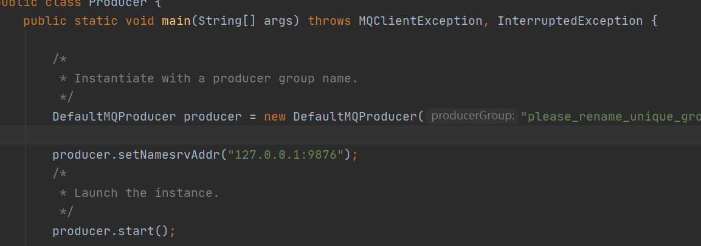
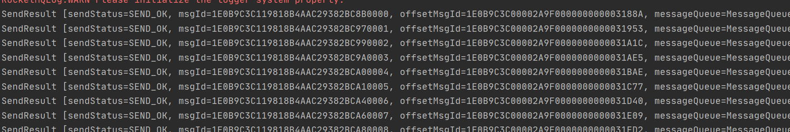

# RocketMQ源码分析之环境搭建 

### MQ下载地址

https://www.apache.org/dyn/closer.cgi?path=rocketmq/4.7.1/rocketmq-all-4.7.1-source-release.zip

下载Binary包和Source包,将Binary包中的Conf文件夹下的broker.conf和logback_broker.xml和logback_namesrv.xml复制到Source包中RocketMQ中的新建的RocketData中的Conf中

###  启动nameServer

设置运行参数

ROCKETMQ_HOME=D://rocketmq/rocketmq-all-4.7.1-source-release/RocketData

###  启动Broker

Program arguments: -c D://rocketmq/rocketmq-all-4.7.1-source-release/RocketData/conf/broker.conf  -n 127.0.0.1:9876

VM options: -server -Xms4g -Xmx4g -Xmn2g

###  启动测试用例

#### Consumer

org\apache\rocketmq\example\quickstart\Consumer.java

运行结果

#### Provider

org\apache\rocketmq\example\quickstart\Producer.java

运行结果

